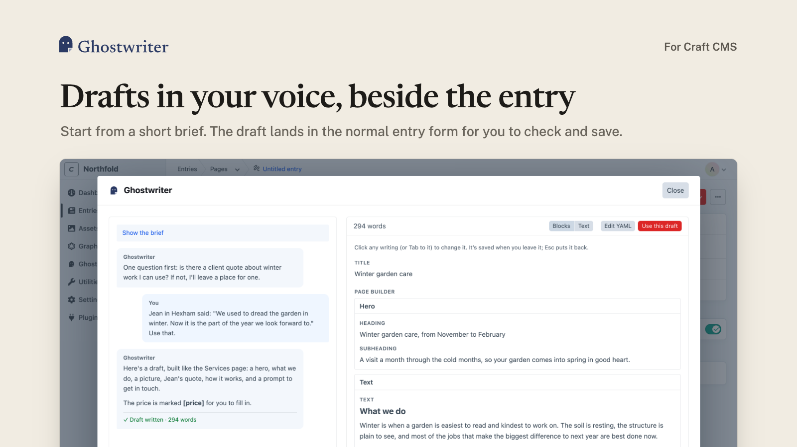
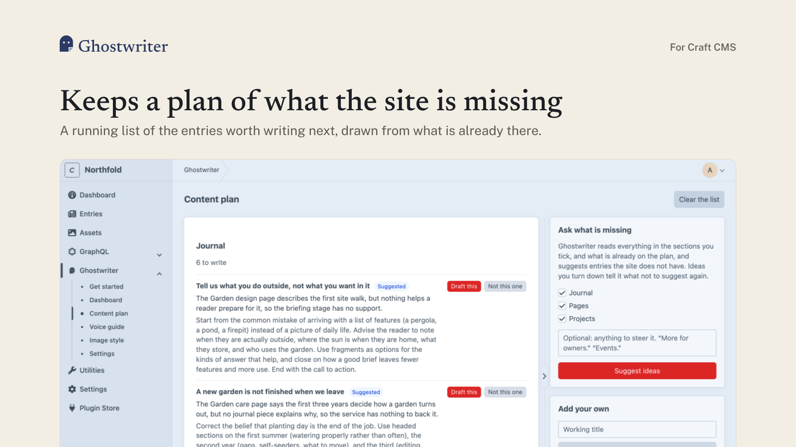
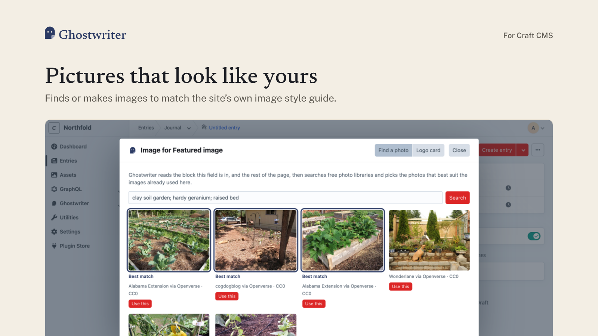
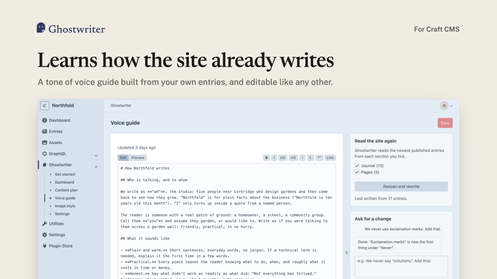

<p align="center">
  <picture>
    <source media="(prefers-color-scheme: dark)" srcset="docs/images/ghostwriter-horizontal-reversed.svg">
    
  </picture>
</p>

# Ghostwriter for Craft CMS

Ghostwriter learns how your site writes, then drafts new entries in that voice. It asks you a short set of questions, follows up on anything it still needs, and puts the draft into the entry form for you to check and save. It works with any section: a single rich text body, a Matrix or Neo page builder, or plain fixed fields.

It runs on Claude, ChatGPT or Gemini, using your own API key.



**[Read the documentation](docs/README.md)**: installation, getting API keys (including free options), and how to use every part of Ghostwriter.

## Features

- **Voice guide.** Ghostwriter reads a sample of your published entries and writes a guide to how the site sounds: who is talking and to whom, how pieces are shaped, the words you use and the ones you never do. You can edit it by hand or ask for changes in plain words.
- **Writes for any section.** It reads each section's field layout and the entries already in it, and works out how pages there are really built. It learns which blocks are used, in what order, and which settings never change. Every section can be written for straight away.
- **Kinds of content.** It suggests the kinds of content each section holds, such as "Studio page" or "Charity partner profile". Each kind you teach it gets its own questions and guidance.
- **Writing beside the form.** **Write with Ghostwriter** on a new entry opens a panel over the form. You answer the brief, Ghostwriter drafts, and you ask for changes in conversation. **Use this draft** puts it into the entry's Craft draft. Nothing is published for you.
- **Editing what exists.** **Edit with Ghostwriter** on an existing entry opens the same panel, with the entry's content as the draft. You ask for changes in plain words, and **Use these changes** puts them into your own Craft draft of the entry, the "edited, not saved" draft Craft keeps per person. Only the writing changes: images, links, settings and switched-off blocks stay as they were, and the live entry is untouched until you save.
- **House style.** Spacer heights, breadcrumbs and heading markup that the section's pages agree on are copied into the new page. A link from a page to itself becomes a link to the new page. A link Ghostwriter can't decide points to `https://example.com`, and is listed so you don't miss it.
- **Images.** A Ghostwriter button sits beside "Add an asset" on image fields. It reads the block the field is in and the page around it. It can find photos in free libraries and pick the ones that best match the images already used there. It can also make a new image in that style, or put a logo on a flat colour or gradient. The image you choose is saved to the field's upload folder and added to the field.
- **Image placeholders.** Image fields a draft leaves empty, where the section's pages usually have an image, get a striped placeholder. That way the layout shows where pictures go.
- **Image style guide.** A written description of the site's images, per section, used whenever images are found or made.
- **Content plan.** Ideas for what to write next, based on what each section already has and what it lacks. Any idea can be opened as a new entry.
- **Get started.** A step-by-step setup guide, and a widget for Craft's own dashboard.

The writer is told to use only facts from the brief and the conversation. It does not invent figures, quotes or client names.

## Screenshots

| | |
| --- | --- |
|  |  |
|  | |

## Requirements

- Craft CMS 5.6 or later
- PHP 8.2 or later
- An API key for Anthropic (Claude), OpenAI (ChatGPT) or Google (Gemini)
- Optional: an OpenAI or Gemini key to make images (Claude does not make images)
- Optional: the Imagick PHP extension, for logo cards and smaller images sent to models

## Installation

Install with Composer from your project's root:

```bash
composer require 1994/ghostwriter-craft
php craft plugin/install ghostwriter
```

Or install it from **Settings → Plugins** in the control panel once it is required.

### API keys

Add your key to `.env`:

```dotenv
ANTHROPIC_API_KEY=your-key
```

| Variable | Used for |
| --- | --- |
| `ANTHROPIC_API_KEY` | Writing with Claude (the default) |
| `OPENAI_API_KEY` | Writing with ChatGPT, or making images |
| `GEMINI_API_KEY` | Writing with Gemini, or making images |
| `UNSPLASH_ACCESS_KEY` | Searching Unsplash for photos (optional) |
| `PEXELS_API_KEY` | Searching Pexels for photos (optional) |
| `PIXABAY_API_KEY` | Searching Pixabay for photos (optional) |

Keys are read from the environment each time they are needed. Ghostwriter never stores them. Openverse needs no key, and is searched for public-domain and CC0 work only.

### Getting started

Open **Ghostwriter → Get started** in the control panel. It walks you through each step:

1. **Connect a model:** checks that your key is set.
2. **Choose where it writes:** the sections to write for, and the sections to learn the voice from.
3. **Learn your voice:** writes the voice guide.
4. **Teach it your kinds of content:** reviews the kinds it suggests for each section.
5. **Describe your images** (optional): writes the image style guide.
6. **Plan what to write** (optional): suggests ideas for the content plan.
7. **Write something.**

Each step can be skipped or redone at any time. Once you're set up, hide Get started from the dashboard. To bring it back, use the link at the foot of the dashboard or **Show Get started** in the settings.

### Permissions

Ghostwriter adds one permission: **Use Ghostwriter**. Writing into an entry also needs Craft's own permission to save entries in that section.

### The queue

Model calls can take a minute or more, so each runs as a job in Craft's queue while the screen checks back for the result. Craft runs the queue from control panel requests by default, so this works with no setup. On a site with a queue worker the jobs run there instead. Each job is allowed three times the configured timeout plus a minute, because a busy provider is tried up to three times.

## Configuration

Settings are on **Settings → Plugins → Ghostwriter**. To set them in code, or differently per environment, copy `vendor/1994/ghostwriter-craft/src/config.php` to `config/ghostwriter.php`. Values there override the settings page.

| Setting | Default | |
| --- | --- | --- |
| `provider` | `anthropic` | `anthropic`, `openai` or `gemini` |
| `model` | provider's default | `claude-opus-5-5`, `gpt-6.1-sol` or `gemini-3.8-flash` |
| `timeout` | `300` | Seconds to wait for one response |
| `sections` | all | Section handles to write for |
| `voiceSections` | all | Section handles read to learn the voice |
| `imageProvider` | first with a key | `openai` or `gemini` |
| `imageModel` | provider's default | `gpt-image-2.5-sunburst` or `gemini-3.1-flash-image` |
| `openverse` | `true` | Search Openverse for free photos |
| `placeholderImages` | `true` | Striped placeholders in empty image fields |
| `suggestKindsAutomatically` | `true` | Look for kinds of content without being asked |
| `guidesPath` | `@config/ghostwriter` | Where prompt overrides are read from, under `prompts/` |

### Where things are kept

Everything Ghostwriter writes (guides, kinds, the plan, conversations, working state) is kept in the database, in its own `ghostwriter_` tables. It works the same on every server, on read-only and load-balanced hosts, and survives deploys. The only files it reads from your project are prompt overrides. Updating from an early build imports the files it kept; see [Configuration](docs/configuration.md#updating-from-an-early-build).

### Prompts

Every prompt is a markdown file in `vendor/1994/ghostwriter-core/resources/prompts/`. To change one for your project, copy it to `config/ghostwriter/prompts/` with the same name and edit it there. Ghostwriter fills in the `[[...]]` placeholders (`[[items]]`, `[[place]]` and so on) with Craft's words, in your copy too.

### Kinds of content

A kind is stored as YAML in the database, and edited on its screen in the control panel:

```yaml
title: Studio page
description: A short landing page for one of the studios.
section: builder
entryType: page              # optional, for sections with several entry types
examples: [1504, 9330]       # optional: model the kind on these entries
questions:
  - handle: lead
    label: Who leads the studio?
    type: text               # text or textarea
    required: true
guidance: |
  Markdown: who the reader is, what each part does and in what order, how long it runs.
checklist:
  - Every fact comes from the brief.
```

## How fields are read

Each field is reduced to a kind:

| Kind | Field types | The writer produces |
| --- | --- | --- |
| text, long text | Plain Text, Color | plain text |
| rich text | CKEditor, Redactor, HTML field | markdown, stored as HTML |
| choice | Dropdown, Radio Buttons, Button Group, Checkboxes, Multi-select | one or more of the field's options |
| toggle, number | Lightswitch, Number, Money, Range | the value |
| blocks | Matrix, Neo (including child blocks) | a list of blocks, each with its own fields |
| rows | Table | rows sharing the same columns |
| reference | Assets, Entries, Categories, Users, Link, Hyper, dates and others | nothing; left for a person, or filled from the house style |

## What is sent to providers

To write, Ghostwriter sends the chosen provider your voice guide, the brief, the conversation, and excerpts from the entries a draft is modelled on. To learn the voice, kinds or image style, it sends samples of published entries and small copies of their images. Photo searches send search words to the photo libraries. Nothing is sent until someone in the control panel asks for it.

## Development

```bash
composer install
cp tests/.env.example tests/.env   # point it at an empty MySQL database
vendor/bin/codecept run unit
```

The tests fake every model and HTTP call, so they need no API key.

## Support

Report issues on [GitHub](https://github.com/1994limited/ghostwriter-craft/issues), or contact [1994](https://1994.co.uk).

## Licence

Ghostwriter is commercial software. See [LICENSE.md](LICENSE.md).
