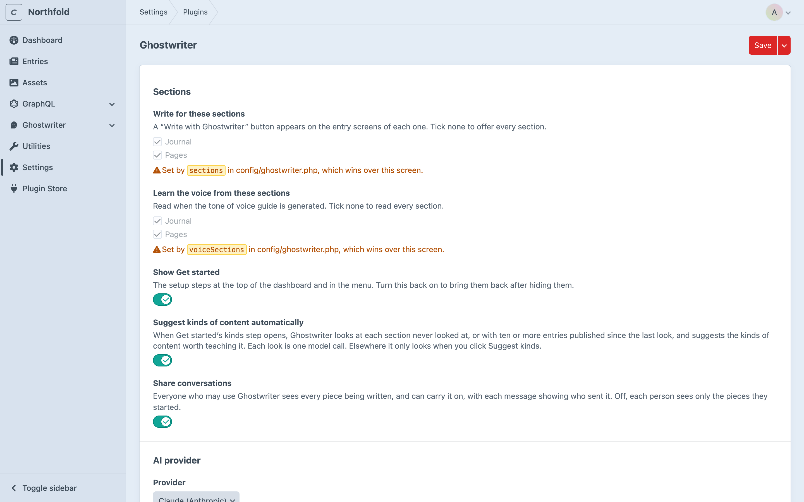
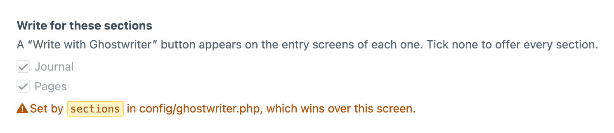

# Configuration

This page covers Ghostwriter's settings, setting them in `config/ghostwriter.php`, where Ghostwriter keeps its work, overriding its prompts, and what it logs.

## Settings

**Settings → Plugins → Ghostwriter**, for admins on an environment where admin changes are allowed. Ghostwriter's own menu links there as **Settings**.



Two kinds of note can sit at the top of the page, for whoever looks after the templates:

- **Page template**: a section's template prints no H1, a logo as the H1, or more than one. Ghostwriter still starts a draft's headings at H2, but the fix belongs in the template. See [Headings](writing.md#headings).
- **Link index**: a section has more pages than Ghostwriter keeps as link targets ("Products has 48,000 entries; Ghostwriter links to the 5,000 most recently updated."). See [Links to your other pages](writing.md#links-to-your-other-pages).

**Sections**

| Setting | What it does |
| --- | --- |
| **Write for these sections** | Sections that get **Write with Ghostwriter**. None ticked means all. |
| **Learn the voice from these sections** | Sections read for the voice guide. None ticked means all. |
| **Show Get started** | The setup steps at the top of the Overview and in the menu. Turn it back on to bring them back after hiding them. |
| **Suggest kinds of content automatically** | Look at each section for kinds when Get started's kinds step opens. Nowhere else looks without a click. Each look is one model call. |
| **New entries start unpublished** | On (the default), a new entry Ghostwriter puts a draft into has its **Enabled** switch turned off, so it can be saved straight away and isn't published by accident. Switch on **Enabled** when it's ready. Existing entries are never changed. `draftsUnpublished` in config. |
| **Share conversations** | On (the default), everyone with **Use Ghostwriter** sees and can carry on every piece. Off, each person sees only the pieces they started. See [Shared conversations](permissions.md#shared-conversations). |

**AI provider**

| Setting | What it does |
| --- | --- |
| **Provider** | Claude (Anthropic), ChatGPT (OpenAI), Gemini (Google) or OpenRouter, for writing. |
| **Model** | Leave blank for the provider's default, shown as the placeholder. A model name that doesn't look like the chosen provider's (a `gpt-…` model with Claude, say) gets a warning; it is still saved. |
| **OpenRouter** | **Connect with OpenRouter** (admins), **Check connection** and **Disconnect**. Says "Using OPENROUTER_API_KEY from .env" when that is set; it always wins. See [OpenRouter](api-keys.md#openrouter). |
| **OpenRouter model for writing**, **OpenRouter model for quick jobs** | With OpenRouter, the model for each tier of work. **Default** uses Claude Opus for writing and Claude Sonnet for quick jobs. |
| **Claude (Anthropic) base URL**, **ChatGPT (OpenAI) base URL**, **Gemini (Google) base URL**, **OpenRouter base URL** | Under **Gateways and proxies**: a gateway to call instead of the provider. Leave blank for the provider itself. See [Gateways and proxies](api-keys.md#gateways-and-proxies). |

**Images**

| Setting | What it does |
| --- | --- |
| **Image provider** | ChatGPT (OpenAI), Gemini (Google) or OpenRouter, for making images. **Whichever has a key** uses OpenAI if its key is set, then Gemini, then OpenRouter. |
| **Image model** | Leave blank for the provider's default. |
| **Mark images still to choose** | Striped placeholders in empty image fields on new entries. See [Placeholders](images.md#placeholders). |

**Stock photos**

| Setting | What it does |
| --- | --- |
| **Free libraries** | Each free library's key, **Set** or **Not set**, and **Search Openverse**. |
| **Paid libraries** | Each paid library's keys, **Check connection** and an **Enabled** switch. See [Stock photos](stock-photos.md#settings). |
| **Search in, by default** | Where the image dialog searches for someone who hasn't chosen yet. |
| **Include editorial images by default** | Off. |

**Finish this page**

| Setting | What it does |
| --- | --- |
| **When a page with things to finish is published** | **Block** (the default) or **Warn**: a fact to add, a link to choose, an image placeholder, template text or a stock photo preview. See [Finish this page](finish-this-page.md#publishing). |
| **Open the guide after a draft is added** | On. Off, the guide stays as each person last left it. |

**Suggest edits and Content to revisit**

| Setting | What it does |
| --- | --- |
| **Check claims** | On. Counts and prices about you ("a team of 6", "from £450") on pages a year old or more are asked about as Facts to check. |
| **Check links to other sites once a week** | Off. On, Content to revisit asks each site your pages link to whether the page is still there. |
| **Dated sections where age counts in full** | None. Channels where a page's age and the years it mentions count in full. |

The section also says when Content to revisit last ran, with the cron line that keeps it daily. See [Suggest edits and Content to revisit](suggest-edits.md#settings).

**Troubleshooting**

| Setting | What it does |
| --- | --- |
| **Log replies that can't be read** | Off by default. On, a model reply Ghostwriter can't read goes into the log in full. See [Logging](#logging). Can be an environment variable. |

**API keys** lists each key Ghostwriter can use as **Set** or **Not set**, never the key itself. Keys aren't settings: see [API keys](api-keys.md).

### Settings fixed in config

A setting in `config/ghostwriter.php` wins over the settings page. Its field is shown locked, with a note: "Set by `sections` in config/ghostwriter.php, which wins over this screen." Change it in the file.



**Show Get started** is the exception. It isn't project config, so it can't be locked; it is Ghostwriter's own state, which the Overview's **Hide** button also changes.

### The time limit

`timeout` is how long Ghostwriter waits for one model call: 300 seconds by default, between 30 and 1800. It's set in `config/ghostwriter.php` only, since it's not on the settings page. Each queue job is allowed three times this plus 60 seconds, because a busy provider is tried up to three times (see [The queue](installation.md#the-queue)).

## config/ghostwriter.php

To set any of these in code, or differently per environment, copy `vendor/1994/ghostwriter-craft/src/config.php` to `config/ghostwriter.php`. It lists every key, commented out.

```php
<?php

return [
    '*' => [
        'provider' => 'anthropic',
        'sections' => ['journal', 'pages'],
        'baseUrls' => [
            'anthropic' => '$GHOSTWRITER_ANTHROPIC_BASE_URL',
        ],
    ],
    'dev' => [
        'sharedConversations' => false,
    ],
];
```

| Key | Default | |
| --- | --- | --- |
| `provider` | `anthropic` | `anthropic`, `openai`, `gemini` or `openrouter` |
| `model` | provider's default | `claude-opus-5-5`, `gpt-6.1-sol` or `gemini-3.8-flash` |
| `baseUrls` | all blank | A gateway per provider: `anthropic`, `openai`, `gemini`, `openrouter`. An address or an environment variable. See [Gateways and proxies](api-keys.md#gateways-and-proxies) |
| `timeout` | `300` | Seconds to wait for one response (30–1800). See [The time limit](#the-time-limit) |
| `sections` | `[]` (all) | Section handles to write for |
| `voiceSections` | `[]` (all) | Section handles read for the voice guide |
| `imageProvider` | `null` | `openai`, `gemini` or `openrouter`; `null` uses whichever has a key |
| `openrouterModels` | both blank | With OpenRouter, `['writing' => '…', 'quick' => '…']` by OpenRouter model id, such as `anthropic/claude-opus-5.5`; blank for the default |
| `imageModel` | provider's default | `gpt-image-2.5-sunburst` or `gemini-3.1-flash-image` |
| `openverse` | `true` | Search Openverse |
| `placeholderImages` | `true` | Striped placeholders in empty image fields |
| `stockLibraries` | `[]` (all on) | Paid photo libraries switched on or off, by ID: `['demo' => false]` |
| `stockDefaultSource` | `free` | Where **Search in** starts: `free`, `everything` or a library's ID |
| `stockIncludeEditorial` | `false` | Include editorial-only images in searches by default |
| `onUnfinishedPublish` | `null` (block) | `block` or `warn` when an entry with something still to finish goes live; `null` reads `stockOnPublish` |
| `stockOnPublish` | `block` | The older stock-only setting, read when `onUnfinishedPublish` isn't set |
| `finishOpenAfterDraft` | `true` | Open the Finish this page guide after a draft is put into an entry |
| `claimChecks` | `true` | Suggest edits asks about counts, prices and claims on older pages ([Suggest edits](suggest-edits.md#settings)) |
| `checkExternalLinks` | `false` | Content to revisit checks links to other sites once a week |
| `ageInFullSections` | `[]` | Channel handles where a page's age counts in full on Content to revisit |
| `shutterstockSandbox` | `null` (dev mode) | Use Shutterstock's sandbox: `true`, `false`, or `null` for dev mode only |
| `stockDemo` | `$GHOSTWRITER_STOCK_DEMO` | Offer the demo library outside dev mode; never in production |
| `stockUnusedDays` | `30` | Days before a preview no entry uses is cleaned up |
| `suggestKindsAutomatically` | `true` | Suggest kinds when Get started's kinds step opens |
| `draftsUnpublished` | `true` | A new entry Ghostwriter writes starts with **Enabled** off; existing entries are never changed |
| `sharedConversations` | `true` | Share conversations with everyone who may use Ghostwriter; `false` keeps each to the person who started it |
| `preview` | `true` | The **Preview** tab: the draft rendered by the section's own template, nothing saved. See [The draft](writing.md#preview) |
| `previewScriptHosts` | `[]` | Hosts whose scripts may run in the Preview tab besides the site's own, such as a CDN: `['https://cdn.example.com']`. Other third-party scripts are blocked there |
| `voiceMaxEntries` | `24` | Entries read for the voice guide |
| `voiceMaxCharsPerEntry` | `6000` | Characters read from each |
| `voiceMaxChars` | `90000` | Characters read in all |
| `imageGuideSamples` | `10` | Images looked at per section for the image style guide |
| `planSuggestions` | `8` | Ideas asked for each time the plan looks for gaps |
| `guidesPath` | `@config/ghostwriter` | Where prompt overrides are read from, under `prompts/` |

API keys are never set here. See [API keys](api-keys.md).

## Where things are kept

Everything Ghostwriter writes is kept in the database, in its own tables. So it works the same on every server, on read-only and load-balanced hosts, and survives deploys.

| What | Table |
| --- | --- |
| Voice guide, image style guide, kinds of content, content plan | `ghostwriter_documents` |
| Conversations and drafts | `ghostwriter_sessions` |
| Working state: suggestions, jobs in hand, photo requests | `ghostwriter_state` |
| Images made or uploaded, waiting to be used (cleared after a day) | `ghostwriter_files` |
| Suggest edits' reviews and their decisions | `ghostwriter_edit_reviews` |
| Content to revisit: each page's row, and the links each page holds | `ghostwriter_revisit`, `ghostwriter_revisit_links` |
| Each page's title, address, summary and paragraph fingerprints, for the review and for links to your other pages | `ghostwriter_entry_index`, `ghostwriter_index_stems` |
| The stock image ledger | `ghostwriter_stock_images`, `ghostwriter_stock_usages` |

The only files Ghostwriter reads from your project are [prompt overrides](#overriding-prompts), in `config/ghostwriter/prompts/`. They're code, so commit them.

Guides, kinds and the plan are content, like your entries: they live in each environment's database. To copy them between environments, copy the database tables, as you would for entries.

### Updating from an early build

Early builds kept guides, kinds and the plan as files in `config/ghostwriter/`, and conversations and working state in `storage/ghostwriter/`. Running `php craft up` after updating imports them into the database. Nothing already in the database is overwritten. The old files are left where they are: check the import, then delete them, keeping `config/ghostwriter/prompts/` if you have one.

## Overriding prompts

Every prompt is a markdown file in `resources/prompts/` of the `1994/ghostwriter-core` package, which Ghostwriter installs (`vendor/1994/ghostwriter-core/resources/prompts/`). To change one, copy it to `config/ghostwriter/prompts/` in your project with the same name and edit it there.

The shared prompts use `[[...]]` placeholders for the words that differ between Ghostwriter's CMSs: `[[item]]` becomes "entry", `[[place]]` "website", and so on. They are filled in your copy too, so you can keep them or write the words out. Keep any `{{ placeholders }}` that are in the original.

| Prompt | Used for |
| --- | --- |
| `writer.md`, `writer-extras.md` | Writing and revising drafts, and the extras prepared with a first draft |
| `brief-writer.md`, `brief-filler.md` | Filling in a brief from a working title and notes |
| `layout-planner.md` | The other layouts of a first draft |
| `seo-editor.md`, `seo-verifier.md` | Choosing links to your other pages, and checking each one |
| `reviser.md` | Applying comments on the page |
| `gap-filler.md` | **Write it for me** and **Write around it** in Finish this page |
| `reviewer.md`, `verifier.md`, `reworder.md` | Suggest edits: the review, the double-check, and **Write another** |
| `voice-analyst.md`, `voice-editor.md` | Writing and changing the voice guide |
| `type-analyst.md`, `kind-finder.md` | Learning and suggesting kinds |
| `planner.md` | The content plan |
| `imagery-analyst.md` | The image style guide |
| `photo-query.md`, `photo-researcher.md`, `photo-picker.md` | Searching for and picking photos |
| `image.md` | Making images |

Keep the reply formats the prompts ask for (the tagged blocks and YAML), or Ghostwriter won't be able to read the answers.

## Logging

Ghostwriter logs to Craft's own logs under the `ghostwriter` category: `storage/logs/web.log`, and `storage/logs/queue.log` for queue jobs. It logs:

- each finished model call, with the provider, model, tokens used and time taken
- each retry of a model call, with the provider, the status and the wait
- each failed model call, with the provider and the error
- a reply cut off at its length limit, asked for again with more room, and (for a plan, a list of kinds, a brief or an image style guide) kept as far as it got
- a reply it couldn't read, with what was wrong with it ("there was no `<type>` block", "the YAML did not parse at line 3"), but not the reply itself
- a failed photo search or ranking, and an image it couldn't read

Prompts and keys are never logged. Replies aren't either, unless you turn on **Log replies that can't be read**.

### Logging unreadable replies

When a reply keeps coming back in a form Ghostwriter can't read, the log says what was wrong but not what the model wrote. To see the reply itself, turn on **Log replies that can't be read** under **Troubleshooting** in the settings, or set `logReplies` in `config/ghostwriter.php`:

```php
'logReplies' => '$GHOSTWRITER_LOG_REPLIES',
```

with `GHOSTWRITER_LOG_REPLIES=true` in `.env` on the environment you're looking into. The whole reply is then added to that log line's context, as `reply`. It is never put in the message itself, and prompts and keys are still never logged.

A reply holds your site's content, and drafts written from it, so turn this on only while you look into a problem, and off again afterwards.
