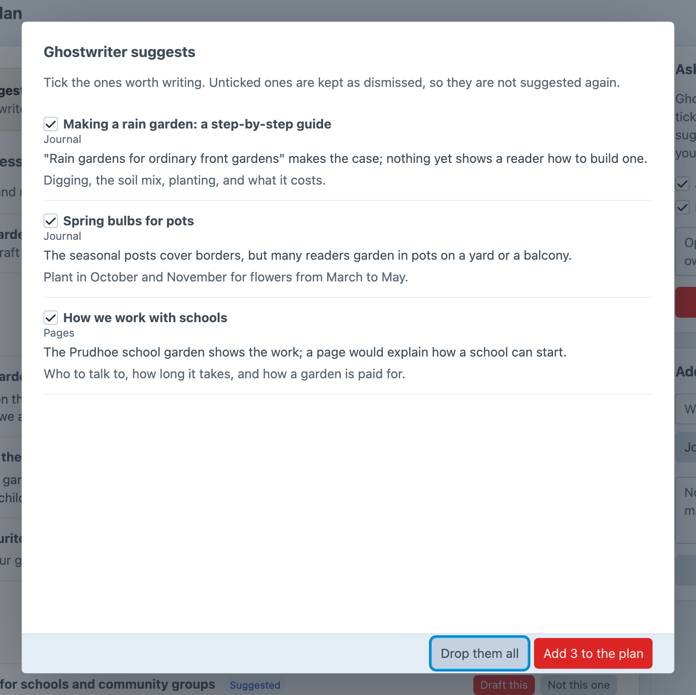
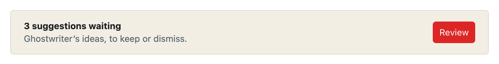
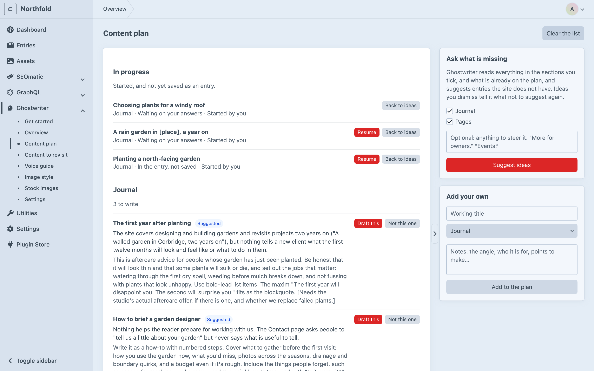

# Content plan

This page covers the content plan: a list of entries the site doesn't have yet, some suggested by Ghostwriter and some added by hand. Each one opens a new entry with Ghostwriter beside it.

Open it from **Ghostwriter → Content plan**.

## Asking what is missing

Under **Ask what is missing**, tick the sections to plan for, add anything to steer it if you like ("More for owners." "Events."), then click **Suggest ideas**.

Ghostwriter reads everything in those sections, and what's already on the plan, and suggests entries the site doesn't have. Each idea comes with a working title, why it's worth writing, and notes on the angle, who it's for and what it should say. It asks for eight ideas each time (`planSuggestions`). It takes a minute or so, and you can leave the page meanwhile. If it finds nothing new, it says "Nothing new to suggest this time."

The suggestions open in a box, **Ghostwriter suggests**, all ticked. Untick any not worth writing, then:

- **Add N to the plan** adds the ticked ones. The unticked ones are kept as dismissed, so they aren't suggested again. With none ticked, the button reads **Add none, dismiss the rest**.
- **Drop them all** throws the whole batch away without remembering any of it, so the same ideas may come up again.

## Suggestions waiting

Closing the box keeps the suggestions. A card at the top of the plan says "N suggestions waiting", and **Review** opens the box again. Only **Drop them all** throws a batch away.

## Adding your own

Under **Add your own**, give a working title, choose the section, add notes if you like, and click **Add to the plan**.

## The list

- **In progress** comes first ("Started, and not yet saved as an entry."): ideas whose piece has been started. Each shows where it has got to: **Ghostwriter is writing**, **Waiting on your answers**, **Draft ready to use**, **In the entry, not saved** or **Something went wrong last time**, with who started it, **Resume** and **Back to ideas**.
- **Open ideas** follow, grouped by section, newest first, with how many there are to write. Ideas Ghostwriter suggested are marked **Suggested**, and an idea for one of your kinds shows the kind.
- **Finished and dismissed** ideas are folded away at the bottom. **Show N finished and dismissed** opens them, and **Hide finished and dismissed** folds them again.

## Writing an idea

Click **Draft this** on an idea. A new entry in that section opens with Ghostwriter open, its title and notes in the [quick brief](writing.md#the-brief), and the brief filled in from them (one model call). Open ideas for a section are also offered in the panel itself, first, under **From the content plan**.

Once you start writing it (not when the entry opens), the idea moves to **In progress**, and **Resume** reopens the piece. **Back to ideas** returns it to the list.

A piece counts as finished once its entry is saved. A draft put into the entry but never saved stays in progress, so it can still be resumed.

## Tidying up

- **Not this one** dismisses an idea. It moves to the finished and dismissed list, and won't be suggested again.
- **Put back** brings a dismissed idea back. Finished ideas can't be put back, since that would write the same piece twice; **Open entry** opens the entry that was written.
- **Delete** removes an idea completely.
- **Delete all dismissed**, with the finished and dismissed ideas, deletes every dismissed idea after asking. Ghostwriter then no longer knows not to suggest them.
- **Clear the list**, at the top of the page, removes every open idea after asking. Started and dismissed ideas stay.

## Where the plan is kept

The plan is kept in the `ghostwriter_documents` table, one document per idea, with each environment's own plan. A batch of suggestions waiting for review is kept with Ghostwriter's working state. See [Where things are kept](configuration.md#where-things-are-kept).
