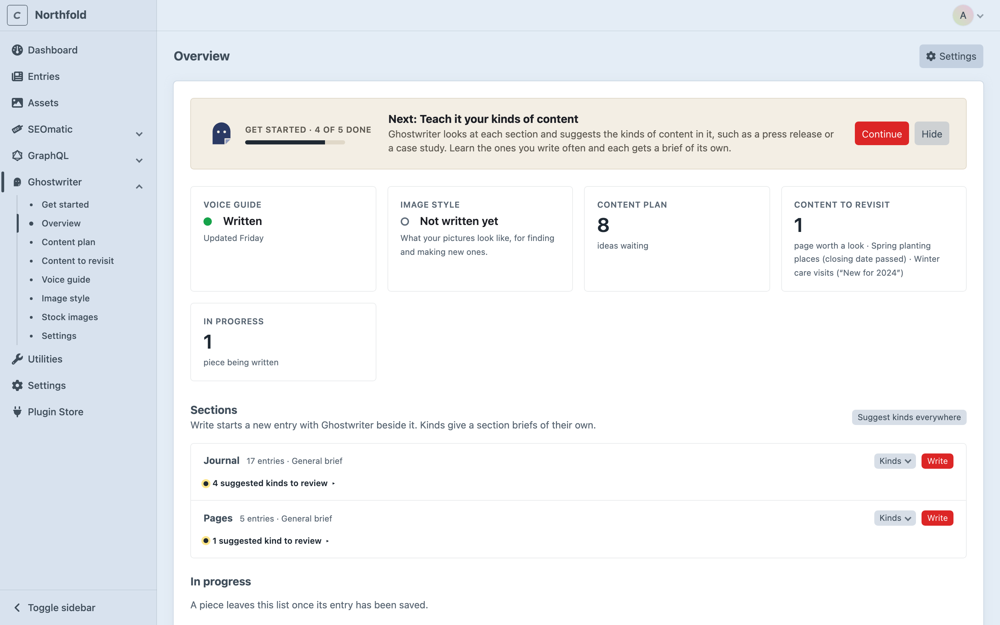
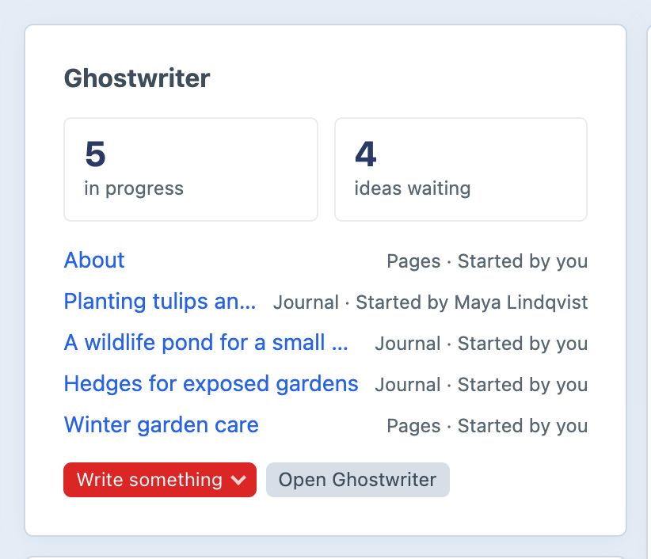

# The Overview

This page covers the Overview, Ghostwriter's own home in the control panel, and the Ghostwriter widget for Craft's Dashboard.

## The Overview

**Ghostwriter → Overview.** Clicking **Ghostwriter** in the navigation opens it. It's called the Overview so it isn't mistaken for Craft's own Dashboard.

### At the top

- **Get started**, while it's shown: "Get started · N of M done", the next step, **Continue** (which opens Get started on that step) and, for admins, **Hide**. Once every required step is done, a smaller **You’re set up** card stays, with **Open Get started**, until Get started is hidden. See [Get started](getting-started.md#finishing-and-hiding-get-started).
- If the writing provider's key isn't set, a one-line warning, **No API key yet.**, says to set it up in Connections (or which variable to add to `.env`), with a link.
- **Settings**, for admins, opens the [plugin settings](configuration.md#settings).

### The tiles

Click a tile to open what it counts.

- **Voice guide**: **Written** or **Not written yet**, and when it was updated.
- **Image style**: **Written** or **Not written yet**, and when it was updated.
- **Content plan**: open ideas waiting on the [plan](content-plan.md).
- **Stock images**, while there are any: stock previews still to license, and how many are on live entries. See [Stock photos](stock-photos.md).
- **Content to revisit**: how many pages are worth a look, and the top three with their main reason ("Spring planting places (closing date passed)"). See [Content to revisit](suggest-edits.md#content-to-revisit).
- **In progress**: pieces being written. With [shared conversations](permissions.md#shared-conversations) on, that's everyone's.

### Sections

A row for each section Ghostwriter writes for, with how many entries it has and how many kinds are learned, or "General brief" when there are none:

- the kinds learned, as labels. Hover for the description; click one to [edit it](kinds.md#editing-a-kind).
- suggested kinds to review ("2 suggested kinds to review"). Open it for **Learn this**, **Learn all N** and **Not this**.
- a **Kinds** menu, with **Teach a kind** ([Teaching a kind yourself](kinds.md#teaching-a-kind-yourself)) and **Suggest kinds**, which looks at this section (one model call)
- **Write**, which opens a new entry in the section with Ghostwriter open

**Suggest kinds everywhere**, above the sections, looks for kinds in every section at once, one model call per section. It's shown when there is more than one section. Opening the Overview never looks for kinds by itself; only [Get started](getting-started.md#4-teach-it-your-kinds-of-content) does.

The page checks back by itself while kinds are being suggested or learned.

### In progress

The pieces being written, everyone's when conversations are shared. Each shows its kind and section, its stage (**Writing**, **Waiting on you**, **Draft ready**, **In the entry, not saved**, **Editing**, **Changes added** or **Failed**), when it last changed and, when shared, "Started by … · last changed by …".

- Click one to reopen it where it was left: on its new entry, or the entry being edited. **Open entry** goes to the entry.
- **Remove** deletes a piece and its conversation, after asking. Any entry already saved isn't touched. It's shown on pieces you started, and on everyone's if you're an admin (see [Deleting a piece](permissions.md#deleting-a-piece)).

A piece leaves the list once its entry is saved. Finished pieces are folded away under **Show N finished**.

At the foot, **Show Get started** brings back a hidden Get started, for admins.

## The dashboard widget

Add **Ghostwriter** to Craft's own Dashboard with **New widget**. Only people with **Use Ghostwriter** can add it. It shows:

- Get started's progress and the next step, until setup is done or Get started is hidden
- how many pieces are **in progress**, and how many **ideas waiting** on the plan
- the newest pieces in progress, with their section and who started each one ("Started by you", "Started by Maya Lindqvist"). With shared conversations on, that's everyone's.
- **Write something**: a menu of the sections to write in
- **Open Ghostwriter**, which goes to the Overview

With nothing in progress it says "Nothing being written right now." In the widget's settings, **Pieces in progress to list** sets how many it lists (5 by default).

Without an API key it says "Ghostwriter has no API key yet." Its links still work, and **Write something** is shown but switched off until a key is added.

