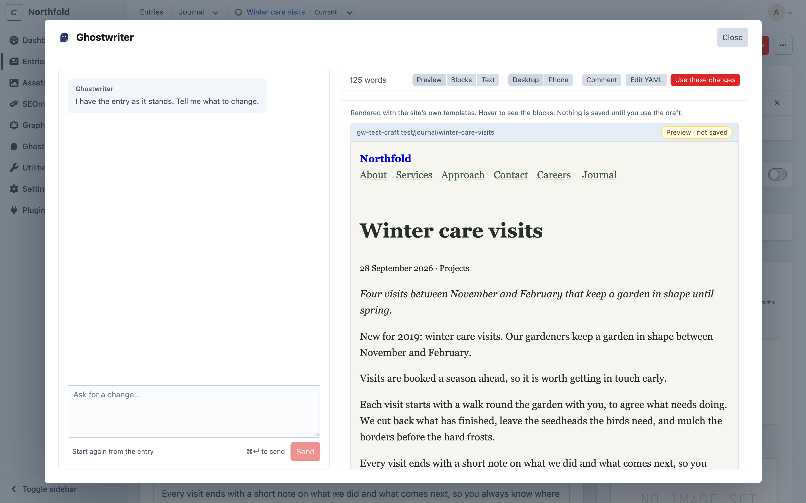
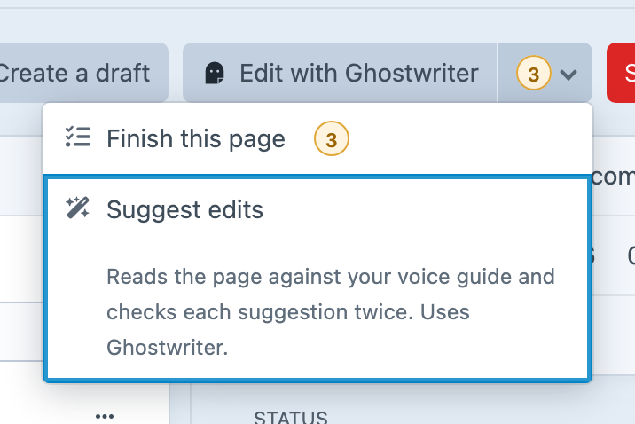

# Editing an existing entry

This page covers changing an entry that already exists, in conversation with Ghostwriter. To write a new one, see [Writing a new entry](writing.md).

## Asking for changes

Open an existing entry in a section Ghostwriter writes for, and click **Edit with Ghostwriter**. The button shows for people with **Use Ghostwriter** who may also save the entry.

The same panel opens, with the entry as the draft. It starts from the entry as you have it, including changes you've typed and not yet saved (Craft keeps those in your own draft of the entry). There is no brief: the entry is the brief. Ghostwriter says "I have the entry as it stands. Tell me what to change." Ask in plain words:

- "Tighten the introduction."
- "Rewrite this for a client who has never commissioned a garden."
- "Add a short section on maintenance before the closing paragraph."

It revises the draft and shows it on the right. There you can also [change any writing where it's shown](writing.md#the-draft), or click **Edit YAML**.

The draft has the same tabs as a new entry's: **Preview** (the entry with the changes, rendered by its template and not saved), **Blocks** and **Text**. You can [comment on the page](writing.md#comments) as well as ask in the conversation.

## The Ghostwriter menu

**Edit with Ghostwriter** is joined to a menu, like Craft's own Save button:

- **Finish this page (3)**: the things left to finish on the page, which opens [the guide](finish-this-page.md#the-guide). Shown only while there are some.
- **Review suggestions (7)**: the open suggestions from the last [review](suggest-edits.md), which opens them. Shown only while there are some.
- **Suggest edits**: "Reads the page against your voice guide and checks each suggestion twice. Uses Ghostwriter." It asks before it runs, with what it costs. See [Suggest edits](suggest-edits.md#suggest-edits).

The menu's button carries one count, before its chevron: what's left to finish plus the suggestions to review. It's amber while anything is left to finish, grey with only suggestions, and gone at nothing. Screen readers hear both ("10 items: 3 to finish, 7 suggestions"). Below 1024 pixels wide, the button shows the Ghostwriter mark alone.

On a new entry the button is **Write with Ghostwriter**, and the menu shows once there's something to finish.

## Use these changes

**Use these changes** puts the revised writing into your own Craft draft of the entry: the "edited, not saved" draft Craft keeps for each person. The form reloads to show it, and a notification says "Changes added to the form. Check them over, then save."

- **The live entry is untouched** until you save. To throw the changes away, discard your draft as usual in Craft.
- **Blocks are matched by type, in order.** The entry's second text block takes the draft's second text block, even if the writer moved it. Blocks you asked to add are added; blocks you asked to remove are removed.

## Start again

**Start again from the entry** throws away the changes asked for and not yet used, and starts again from the entry as it stands. You're asked first. The conversation is kept.

## Coming back

If you close the panel, or reload the page, before using the changes, they are kept. **Edit with Ghostwriter** picks up the same conversation.

Once changes have gone into the entry, the next **Edit with Ghostwriter** starts from the entry again, so anything you've changed by hand since is included.

Conversations are [shared](permissions.md#shared-conversations) by default, so a colleague opening the entry carries on the same conversation. Each message shows who sent it.

## What is not changed

Only the writing changes. Plain text, rich text, and the words inside Matrix and Neo blocks are replaced. Everything else is kept as it was:

- images
- related entries, categories and dates
- links
- choices and settings Ghostwriter wasn't asked about
- blocks that are switched off

Editing never applies [house style](fields.md#house-style) or [image placeholders](images.md#placeholders). Those are for building new entries; an existing entry keeps its own.
