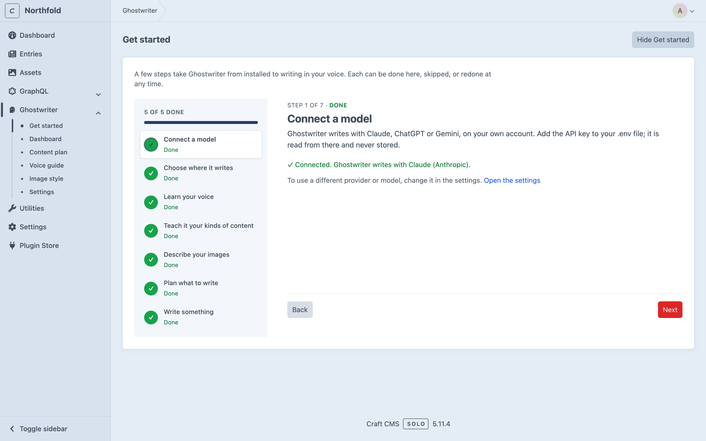
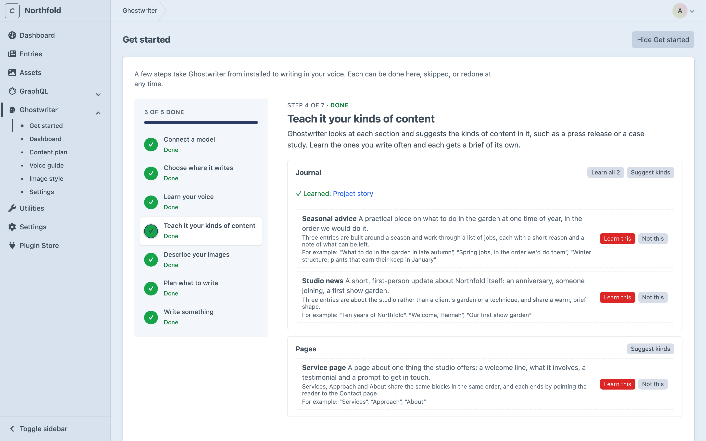

# Get started

Get started is a wizard of seven steps that takes Ghostwriter from installed to writing in your voice. It's shown until it's finished or hidden.

Once Ghostwriter is [installed](installation.md) and has a [key](api-keys.md), open **Ghostwriter → Get started** in the control panel. The steps are listed down the left, each marked **Done**, **To do**, **Optional** or **Working…**, with a bar above them. Nothing needs ticking off: each step works out from the site whether it's done. **Next** and **Back** move between steps, and **Skip** passes one by. Click any step in the list to go straight to it, or to do it again.

Steps 3 to 6 each make one or more model calls, which run in [Craft's queue](installation.md#the-queue). The page checks back by itself until each one is done, and you can leave it meanwhile.

To link to a step, add `#step-` and its number: for example `/admin/ghostwriter/setup#step-3`. **Continue** on the Overview opens the next step this way.

## 1. Connect a model

Done once the writing provider's key is set up in **Connections** (the step's button opens it) or in `.env`. The step names the provider Ghostwriter writes with ("Connected. Ghostwriter writes with Claude (Anthropic)."). If the key is missing, it says so; set it up and click **Check again**. If another provider's key is set already, it suggests choosing that provider in the settings.

## 2. Choose where it writes

A table of your sections, with two ticks each: **Write for it** (the section gets **Write with Ghostwriter**) and **Learn the voice from it**. Leave them all unticked to use every section. Click **Save these sections**.

This step saves the plugin's settings, so only admins can change it, on an environment where admin changes are allowed. Everyone else sees the sections Ghostwriter writes for, and "An admin can change this in the settings." If `sections` or `voiceSections` is set in `config/ghostwriter.php`, that wins (see [Configuration](configuration.md#settings-fixed-in-config)).

## 3. Learn your voice

Tick the sections to read under **Read the newest published entries from:**, then click **Write the voice guide**. Ghostwriter reads their newest published entries and writes the [voice guide](guides.md#the-voice-guide). This takes a minute or so. Once it's written, the step shows the start of the guide, with **Read and edit the whole guide**, and the button becomes **Read the site again**.

Without a voice guide, Ghostwriter still writes, but in a plain voice rather than yours.

## 4. Teach it your kinds of content

When this step opens, Ghostwriter looks through each section and suggests the kinds of content in it, such as "Case study" or "Service page". Each section it looks at is one model call. It looks at a section the first time, and again after ten new entries. A section needs at least two live entries.

Review the suggestions here: **Learn this**, **Learn all N** or **Not this**. **Suggest kinds** beside a section looks at it again. Before anything has been looked at, **Suggest kinds for every section** looks at them all.

Get started is the only place kinds are suggested without someone asking. Elsewhere, they wait for **Suggest kinds** or **Suggest kinds everywhere**, so no model call happens unless someone clicks. To stop it here too, turn off **Suggest kinds of content automatically** in the [settings](configuration.md#settings). See [Kinds of content](kinds.md).

## 5. Describe your images (optional)

Click **Describe the images**. Ghostwriter writes the [image style guide](guides.md#the-image-style-guide) from the pictures your entries use. Once it's written, the step shows its start, with **Read and edit the whole guide**.

## 6. Plan what to write (optional)

Click **Suggest ideas**. Ghostwriter suggests entries the site is missing, for the [content plan](content-plan.md). Add a line to steer it first if you like, such as "More for owners."

## 7. Write something

Choose a section under **Start writing**. A new entry opens with Ghostwriter beside it. See [Writing a new entry](writing.md).

## Finishing and hiding Get started

Only the required steps count towards "N of M done" at the top. The two optional steps don't.

Once every required step is done, the Overview's card becomes a smaller **You’re set up** card, which stays until Get started is hidden.

Get started is hidden for everyone on the site, so only admins can hide it or bring it back:

- **Hide Get started**, at the top of Get started, or **Hide** on the Overview's card, removes it from the Overview and the Ghostwriter menu. On the last step, **Finish and hide this** does the same.
- To bring it back, click **Show Get started** at the foot of the [Overview](dashboard.md), or turn on **Show Get started** in the settings.

Everyone else sees the same steps without these buttons. Their last step has **Finish**, which goes to the Overview.

The steps are in the order that gives good drafts soonest. The voice guide matters most, because every draft follows it. Kinds come next, because a kind gives the writer the right questions and examples. Nothing depends on the image style or the plan.

Next: [API keys](api-keys.md).
