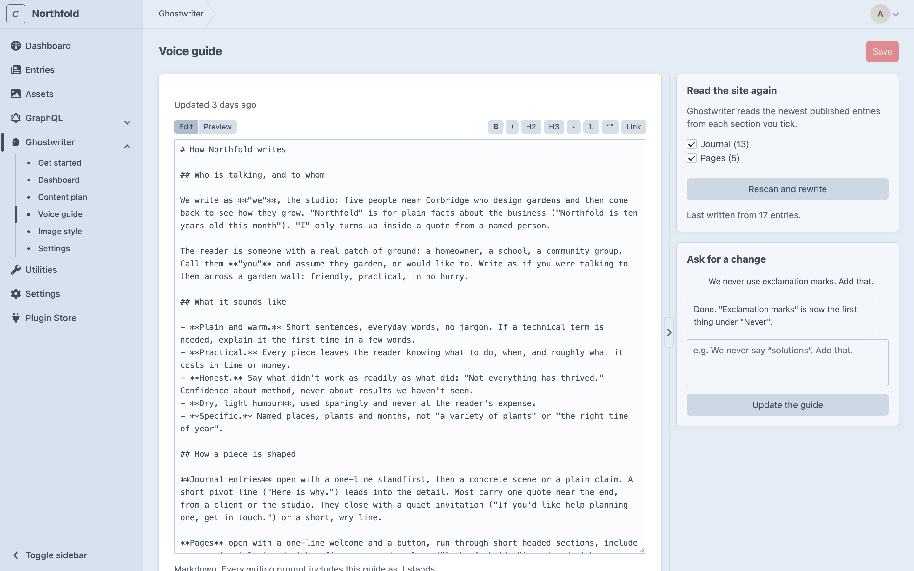
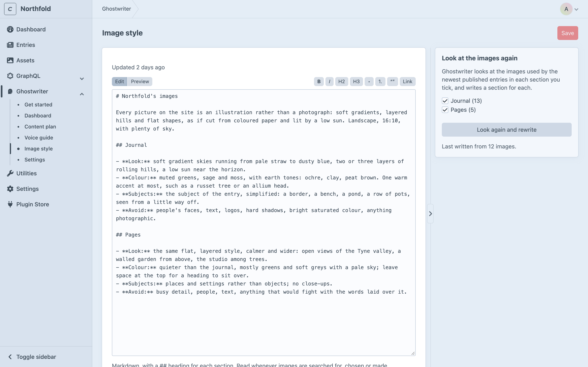

# Voice guide and image style

This page covers Ghostwriter's two written guides: the voice guide, which every draft follows, and the image style guide, which every image search follows. Both are markdown, kept in the database (see [Where things are kept](configuration.md#where-things-are-kept)), and yours to edit. Each environment has its own.

## The voice guide

**Ghostwriter → Voice guide.** Everything Ghostwriter writes follows it.

### Writing it

Under **Read the site again**, tick the sections to learn from, then click **Write the voice guide**. At least one section must be ticked. Ghostwriter reads the newest published entries from each, up to 24 entries, and writes the guide. This takes a minute or so, and you can leave the page meanwhile. The guide covers:

- who is talking, and to whom
- how pieces are shaped and how they open
- the words used, and the ones never used
- real examples from your entries

Once there is a guide, the button becomes **Rescan and rewrite**. It reads the entries again and replaces the guide, including any edits you've made, so you're asked first.

How much is read is set by `voiceMaxEntries`, `voiceMaxCharsPerEntry` and `voiceMaxChars` in [`config/ghostwriter.php`](configuration.md#configghostwriterphp).

### Changing it

- **Edit it by hand.** The editor has **Edit** and **Preview** tabs and a small toolbar for headings, lists, quotes and links. Click **Save** (or press **⌘S**) when done.
- **Ask for a change** in plain words, such as "We never say *solutions*. Add that." Then click **Update the guide**. Ghostwriter rewrites the guide to include it. The last few changes asked for are shown, with what it said it did.

Save your edits before you click **Update the guide** or **Rescan and rewrite**, since what Ghostwriter writes replaces the guide.

## The image style guide

**Ghostwriter → Image style.** A description of what your pictures look like, with one `## heading` for each section: photography or illustration, subjects, composition, light, colour, and what never appears.

### Writing it

Under **Look at the images again**, tick the sections to look at, then click **Describe the images**. Ghostwriter looks at the images used by the newest published entries in each section, in every image field, including those inside Matrix and Neo blocks. It looks at up to ten per section (`imageGuideSamples`). A section needs at least three images to get a section in the guide.

Once there is a guide, the button becomes **Look again and rewrite**, which replaces it. You're asked first.

### Changing it

Edit it in the same editor as the voice guide, and click **Save**. Keep a `## Section name` heading for each section: that's how Ghostwriter finds the part that applies to an image.

### Where it is used

The image style guide is read whenever an image is found or made with the [image button](images.md):

- to choose what to search the photo libraries for
- to rank the photos that come back
- to describe the picture when an image is made

## When something goes wrong

If writing or changing a guide fails, **That didn’t work** and the reason stay shown on the page until the next run. Click the button again to retry. See [Troubleshooting](troubleshooting.md).
