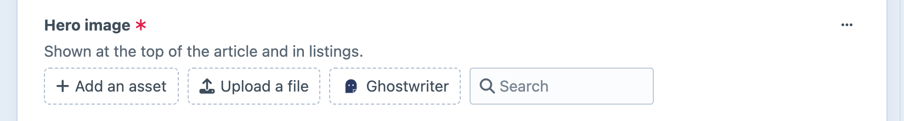
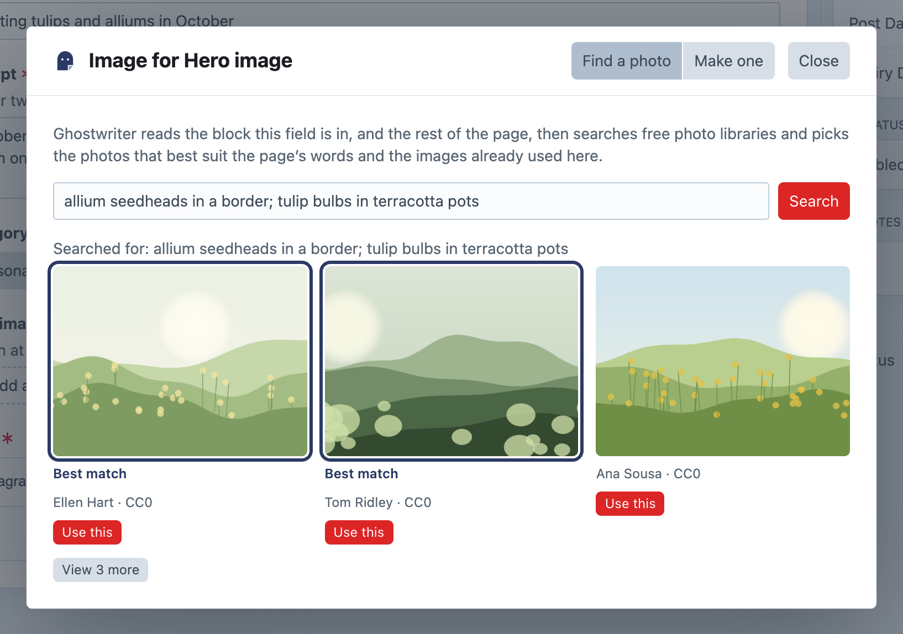
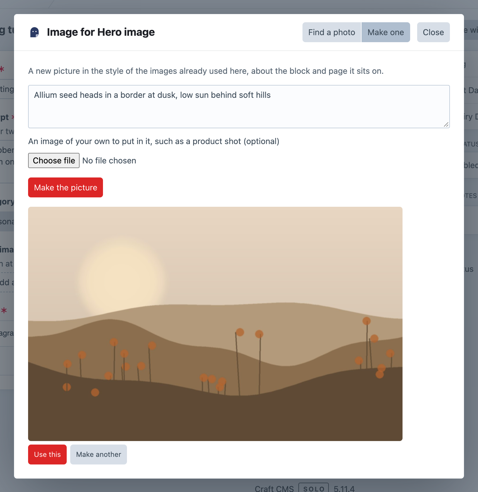

# Images

This page covers the image button: finding a free photo or making an image for an Assets field, and what happens to the image you choose.

## The image button

On every Assets field that takes images, in the sections Ghostwriter writes for, a dashed **Ghostwriter** button sits beside **Add an asset** and **Upload a file**. When the field is full, it sits just below the field instead. Click it to choose an image for that one field. The dialog is titled "Image for" and the field's name, such as "Image for Hero image".

Ghostwriter reads the Matrix or Neo block the field is in first, then the rest of the entry, then looks at the images other entries use in the **same place**: the same field, in the same kind of block (or, failing that, a block of the same family, such as "Link Grid – Bottom Text" for "Link Grid – Center Text"). Everything it finds or makes is chosen for that spot, in the shape (landscape, portrait or square) those images have. Where no other entry has an image in that place yet, the dialog says so at the top: there is no style to match, so photos are chosen and pictures made from the words alone.

The dialog has up to two tabs, **Find a photo** and **Make one**, shown only when both are available.

The button isn't shown on fields that only accept other kinds of file (PDFs, say), on fields with no upload location, or when there's no way to get an image: Openverse off, no photo library key, and no OpenAI or Gemini key. It's also only for people with **Use Ghostwriter** who can save the entry.

## Find a photo

Searches free photo libraries, then has the model rank what comes back. It ranks against the block's and page's words, and against the images already used in that place when there are any. The tab's intro says so: "Ghostwriter reads the block this field is in, and the rest of the page, then searches free photo libraries and picks the photos that best suit the page's words and the images already used here."

- Type what the picture should show, or leave it empty and Ghostwriter chooses three searches from the block and page. Separate your own searches with semicolons. **Searched for: …** above the results lists every search that ran, which explains odd results.
- The model checks each photo's subject against the page, using the library's own description of it too, and leaves clear misses out. With images already in that place, it also matches their style. Without any, a line says "Compared with the page; there are no other images here to match."
- If nothing fits, Ghostwriter searches again with better words the model suggests. If that finds nothing suitable either, the photos are shown as the libraries returned them, with "None of these quite fit the page, even after searching again. Try other words."
- The three best come first, and **View N more** shows the rest (**Show the best three** folds them away again). They're marked **Best match** only when the model judged them; hover one to see why. Without a writing key, or if the model call fails, a line says "These were not compared with the page, so they are in search order.", and none is marked.
- Each photo shows its credit and licence, linking to its page on the library. Click the photo, or **Use this**, to choose it.

Libraries searched:

| Library | Needs | Licence of what's found |
| --- | --- | --- |
| Openverse | nothing (switch off with **Search Openverse**) | CC0 or public domain only |
| Unsplash | `UNSPLASH_ACCESS_KEY` | Unsplash licence |
| Pexels | `PEXELS_API_KEY` | Pexels licence |
| Pixabay | `PIXABAY_API_KEY` | Pixabay licence |

See [API keys](api-keys.md#free-photo-libraries) for getting the free keys.

Paid libraries, and a demo library for trying them, are searched from the same tab with **Search in**; a paid photo goes in as a preview to license. See [Stock photos](stock-photos.md).

### Names, alt text and credits

A chosen photo's file name, title and alt text come from the library's own title and description of it, falling back to the search that found it. For example, `potter-mending-a-bowl-x7k2qa.jpg`, titled "Potter mending a bowl".

The alt text goes in the asset's own **Alternative Text**, Craft's native alt field, so templates can use `asset.alt` as usual.

The credit and licence go in a plain text field on the volume, if its field layout has one whose handle includes `credit`, `attribution`, `copyright`, `caption` or `source`: for example "Jane Doe on Unsplash, Unsplash licence", with a link to the photo's page. Add such a field to your volume to keep credits. Where a library asks for a credit (Unsplash and Pexels do) and your volume has no such field, add it to your content yourself. Ghostwriter tells Unsplash each time one of its photos is used, as Unsplash's guidelines ask.

## Make one

Makes a new picture in the style of the images already used there, about the block and page it sits on. It needs an OpenAI or Gemini key (Claude doesn't make images); the tab is hidden without one.

- **Anything it should show (optional)**: steer the picture. Leave it blank and Ghostwriter decides from the block and page.
- **An image of your own to put in it, such as a product shot** (optional). It's used as it is, not redrawn.

Click **Make the picture**. It takes a minute or two. **Use this** puts it in the field; **Make another** tries again.

Ghostwriter never draws a real company's logo from memory. To put a real logo or product in a picture, add it as an image of your own.

## What happens when you choose one

The image is saved as an asset in the **field's own upload location**, named as above, and put into the field, as if you'd uploaded it:

- In a field that holds one image, it replaces what was there.
- In a field that holds several, it's added. If the field is already full, the image is saved to Assets and the dialog says "This field is full. Image saved to Assets; remove an image from the field to make room."
- A striped placeholder (see below) comes out either way.

A notification says "Image added. Save to keep it." **Nothing is saved to the entry** until you save it.

## Placeholders

When a draft is put into a **new** entry and leaves an image field empty, where the section's entries usually have an image in that place (or the field is required), Ghostwriter puts in a striped "image to choose" placeholder. This shows where pictures go. Optional images, such as a background most entries leave empty, are left alone.

- A field that already holds an image in the entry, chosen with the image button or uploaded while the piece was being written, keeps it. Using the draft again doesn't cover it with a placeholder.
- An empty Matrix or Neo field gets one block with a placeholder only when every one of its block types holds nothing but images (a gallery, say), and its entries usually have one.
- The placeholder is one shared asset, `ghostwriter-image-placeholder.png`, in the field's volume.
- The notification after **Use this draft** lists every field that has one. Replace each with the image button before publishing.

Turn placeholders off with **Mark images still to choose** in the settings.

## Requests are private

A photo search or a picture being made belongs to the person who asked for it. Nobody else can open it, even with conversations shared. Pictures made but not used are kept for a day in Ghostwriter's own table, then cleared away.
