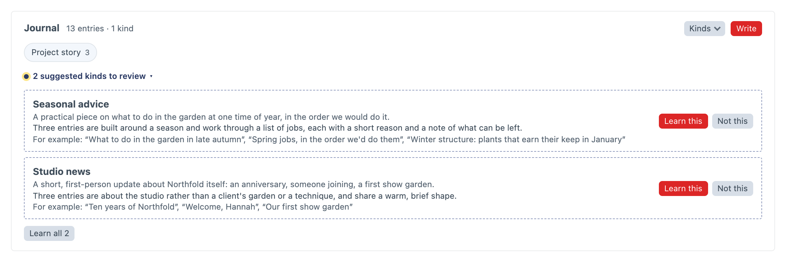
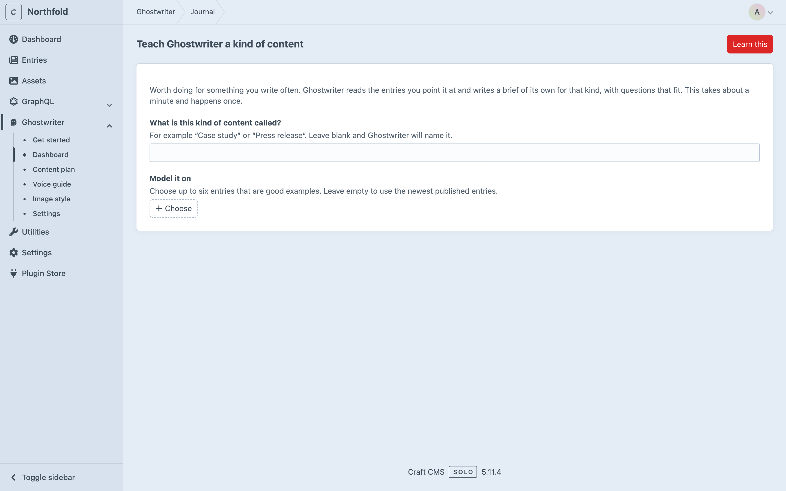
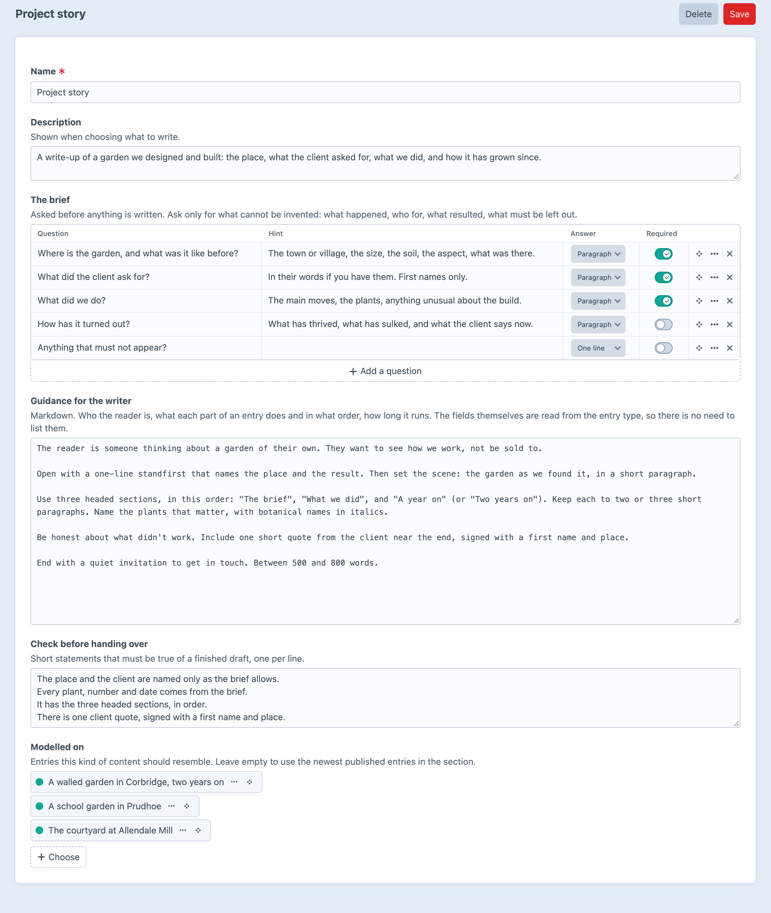

# Kinds of content

This page covers kinds of content: what they are, how Ghostwriter suggests them, and how to teach and edit them.

A kind is a type of entry you write often in a section, such as "Case study", "Service page" or "Charity partner profile". Each kind has:

- **A brief**: the questions Ghostwriter asks before writing one.
- **Guidance**: who the reader is, what each part does and in what order, how long it runs.
- **A checklist**: statements that must be true of a finished draft.
- **Examples**: entries it should resemble. The writer is shown them, and their layout is followed.

Without any kinds, Ghostwriter writes from a general brief (**Something else**). Kinds make drafts noticeably better, because the questions and examples fit.

## Suggested kinds

Ghostwriter looks through a section's published entries and suggests the kinds it finds. Suggestions appear under each section on the [Overview](dashboard.md), as "N suggested kinds to review", and in Get started. Each card shows the kind's name and description, a line on why it's worth teaching, and up to three of the entries it was found in ("For example: …").

- **Learn this** learns one kind from the entries it was suggested from. It takes about a minute.
- **Learn all N** learns every suggestion for that section, one after another. You're asked first, since each is one model call and takes about a minute.
- **Not this** dismisses a suggestion. Ghostwriter remembers it, and won't suggest it again.



Kinds are suggested automatically only in [Get started](getting-started.md#4-teach-it-your-kinds-of-content). When its kinds step opens, it looks at each section it hasn't looked at yet, or that has ten new entries since. Each look is one model call, and a section needs at least two live entries. Turn off **Suggest kinds of content automatically** in the settings and Get started waits for a click too.

Everywhere else, kinds wait until someone asks, so no model call happens unless someone clicks:

- **Suggest kinds**, in a section's **Kinds** menu on the Overview, looks at that section.
- **Suggest kinds everywhere**, at the top of the Overview's sections, looks at every section. It's shown when there is more than one section.

## Teaching a kind yourself

Click **Teach a kind** in a section's **Kinds** menu on the Overview, or beside **What are you writing?** in the writing panel. The page, **Teach Ghostwriter a kind of content**, says what teaching a kind is for.

1. **What is this kind of content called?** For example "Case study". Leave it blank and Ghostwriter names it.
2. **Model it on**: up to six entries that are good examples. Leave it empty to use the newest published entries.
3. Click **Learn this**.

Ghostwriter reads the section's field layout and the chosen entries, then writes the brief, guidance and checklist. It appears on the Overview in a minute or so.



## Editing a kind

Click a kind's label on the Overview to edit it:

- **Name** and **Description** (shown when choosing what to write).
- **The brief**: each question has a hint, an **Answer** length (**One line** or **Paragraph**), and whether it's **Required**. A kind needs at least one question. Ask only for what can't be invented: what happened, who for, what resulted, what must be left out.
- **Guidance for the writer**: markdown. There's no need to list the fields; they're read from the entry type.
- **Check before handing over**: one statement per line.
- **Modelled on**: the example entries.

**Delete** removes the kind. Entries already written with it aren't affected.



### Something like what is already here

Without teaching anything, the writing panel also offers **Something like what is already here**: groups of entries built the same way (the same Matrix or Neo blocks), found from the section's own entries. Choosing one starts the general brief, modelled on those entries. It's shown only when a section's entries come in more than one shape. See [What are you writing?](writing.md#what-are-you-writing)

## When a field layout changes

Kinds are learned from a section's field layout as it was at the time, but drafts are always built from the layout as it is now. If the change matters to how entries are written, edit the kind's guidance, or teach it again.

## Where kinds are kept

Kinds are kept in the `ghostwriter_documents` table, one document per kind, and edited on their screen. Suggestions waiting for review, and the ones you dismissed, are kept with Ghostwriter's working state. See [Where things are kept](configuration.md#where-things-are-kept).

Each kind is stored as YAML, like this:

```yaml
title: Studio page
description: A short landing page for one of the studios.
section: builder
entryType: page              # optional, for sections with several entry types
examples: [1504, 9330]       # optional: model the kind on these entries
questions:
  - handle: lead
    label: Who leads the studio?
    type: text               # text or textarea
    required: true
guidance: |
  Markdown: who the reader is, what each part does and in what order, how long it runs.
checklist:
  - Every fact comes from the brief.
```
