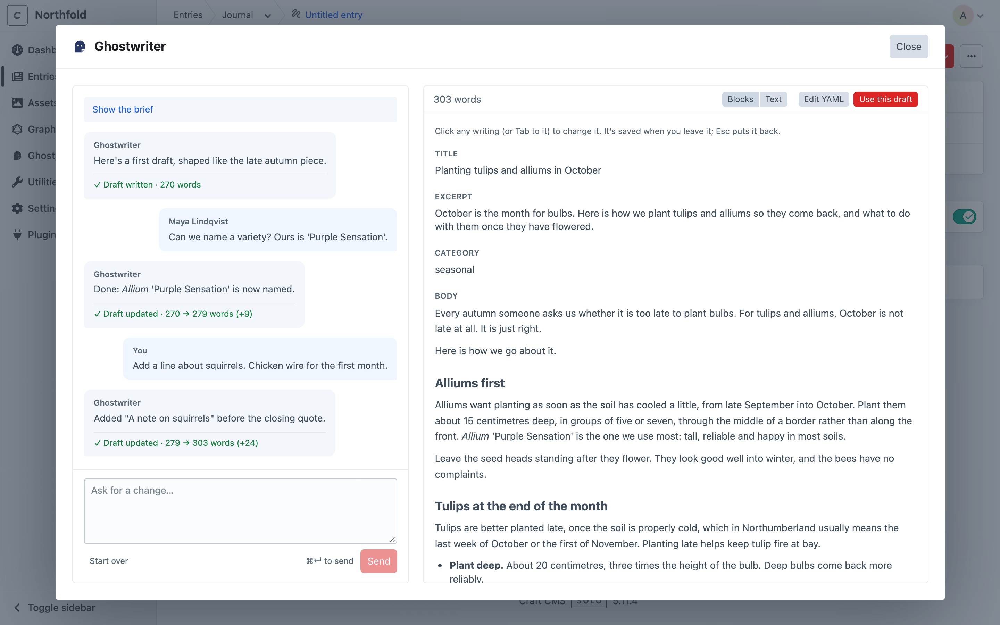

# Permissions

This page covers who can use Ghostwriter, who manages it, how conversations are shared, and who can delete a piece.

## Using Ghostwriter

Ghostwriter adds two permissions under **Settings → Users → User Groups** (or on a user's own permissions): **Use Ghostwriter**, and **License stock images** (see [below](#licensing-stock-images)).

People with it see:

- Ghostwriter in the control panel's navigation, with the Overview, Content plan, Content to revisit, Voice guide, Image style and Stock images
- **Write with Ghostwriter** on new entries, and beside **New entry** on the entry index, in the sections Ghostwriter writes for
- **Edit with Ghostwriter** on existing entries in those sections, with its menu: [Finish this page](finish-this-page.md), and [Suggest edits](suggest-edits.md) for people who can save the entry
- the image button on Assets fields
- the Ghostwriter widget, which they can add to Craft's Dashboard

They also share the voice guide, image style guide, kinds of content and content plan, and can change them: edit or rewrite a guide, edit or delete a kind, add, dismiss or delete ideas. These are the writing team's shared tools, like the entries themselves.

Writing into an entry still needs Craft's own permission to save entries in that section. Ghostwriter never lets anyone change an entry they couldn't change by hand.

Content to revisit lists only the sections whose entries each person can view. Snoozing a page needs permission to save it, and saving alt text from Suggest edits needs permission to save the volume's assets.

## Licensing stock images

**License stock images** (`ghostwriter:license`) lets someone license a paid stock photo, which spends money or your account's allowance. Nobody has it by default; admins do. Without it, the badge under a preview says "Ask a manager to license", with **Request licence**. Inserting a preview needs only **Use Ghostwriter**. See [Stock photos](stock-photos.md#permissions).

## Managing Ghostwriter

Admins manage Ghostwriter. They can:

- change the [settings](configuration.md#settings), on an environment where admin changes are allowed (`allowAdminChanges`), like any plugin's settings
- choose where it writes, in [Get started](getting-started.md#2-choose-where-it-writes) step 2 (this saves the settings, so it also needs `allowAdminChanges`)
- hide and show [Get started](getting-started.md#finishing-and-hiding-get-started), which works on every environment, since it isn't project config
- delete anyone's piece (see [Deleting a piece](#deleting-a-piece))

## Shared conversations

Every conversation is shared with everyone who has **Use Ghostwriter**. Everyone's pieces show in:

- **Or carry on with**, in the writing panel
- **In progress**, on the [Overview](dashboard.md), and the widget
- **Resume**, on the [content plan](content-plan.md)
- **Edit with Ghostwriter**, on an entry

So a colleague can pick a piece up where you left it.

Each message shows who sent it: "You", or the person's name. "Started by … · last changed by …" shows beside each piece under **Or carry on with**, on the Overview and in the widget; the panel itself doesn't show it.

Ghostwriter answers one request at a time. While someone's request runs, others see "Maya is waiting on Ghostwriter". They can't send a message or change the draft until it has answered.



To keep each piece to the person who started it, turn off **Share conversations** in the settings, or set it in `config/ghostwriter.php`:

```php
return [
    'sharedConversations' => false,
];
```

With it off, nobody else sees or opens a piece.

## Deleting a piece

With sharing on, only the person who started a piece, or an admin, can delete it with **Remove**. Others don't see the button, but they can still carry the piece on.

Next: [Configuration](configuration.md).
