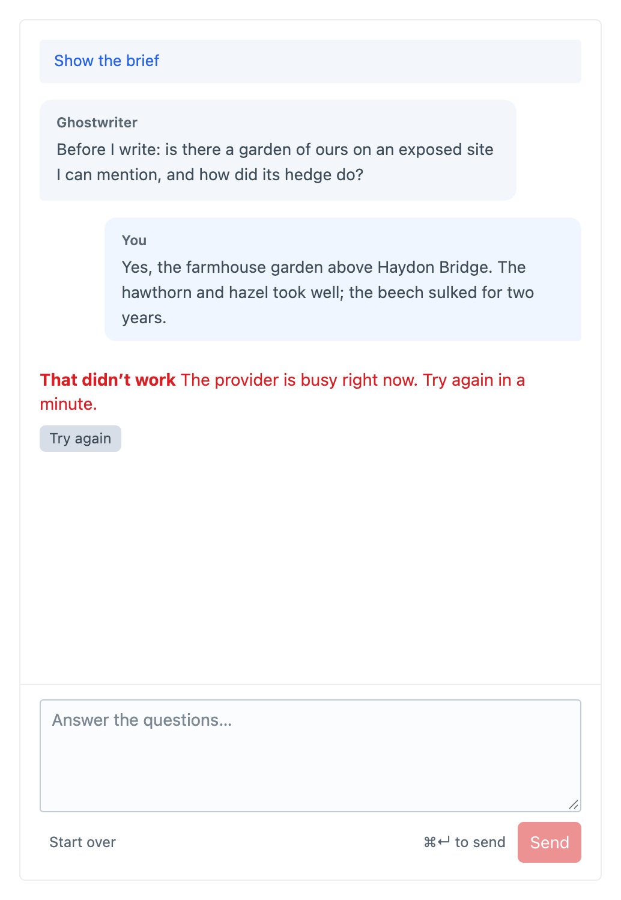

# Troubleshooting

This page covers the problems people most often meet with Ghostwriter, and what to do about each one.

## "No API key yet"

The chosen provider's key isn't in the environment. Add it to `.env` (see [API keys](api-keys.md)) and reload the page. On a server, check the variable is set where your host keeps environment variables, then redeploy or restart PHP if your host needs it.

**Settings → Plugins → Ghostwriter** lists which keys Ghostwriter can see, as **Set** or **Not set**.

## Nothing happens after asking

Model calls run in [Craft's queue](installation.md#the-queue).

- **Using a queue worker?** If `runQueueAutomatically` is `false`, make sure the worker is running (`php craft queue/listen`, or your host's daemon).
- **Look at the queue.** **Utilities → Queue Manager** shows the job, and any error.
- **Hidden browser tab.** Without a worker, Craft only runs the queue while a control panel page is open. Keep the tab open, or use a worker.

## A model call times out

Long drafts can take several minutes on the larger models. A call that runs past the time limit isn't tried again. Raise `timeout` in [`config/ghostwriter.php`](configuration.md#the-time-limit), for example to `600`. If you run a queue worker with its own time limit, raise that too.

## "That didn't work"

Shown with the reason, and **Try again**, which sends the same message again, so nothing has to be typed twice. The reason is the provider's or Ghostwriter's own. Common ones:

- **"The analysis came back in a form that could not be read. Try again."** When learning a kind, the model's answer couldn't be read, even after one automatic retry. Try again; it usually works the second time. If it keeps happening for one section, teach the kind by hand and choose fewer, more typical example entries.
- **"The answer ran past its length limit and was cut off"**: a reply that stops at the model's length limit is asked for once more with twice the room. If a draft, a voice guide or a kind's description is cut off again, the error is shown rather than half of it. Ask for something shorter, or split the piece in two. A content plan, a list of suggested kinds, a brief or an image style guide is kept as far as it got, with a warning in the log.
- **"Ghostwriter did not come back with any ideas"**, **"…any kinds"** or **"…could not put a brief together"**: the model's answer wasn't in the form asked for. Try again. If it keeps happening, see [Seeing what went wrong](#seeing-what-went-wrong).
- **OpenAI image models need verification:** see [OpenAI](api-keys.md#openai-chatgpt-and-images).

## Busy, overloaded or rate limited

Ghostwriter has already tried again up to 3 times, waiting longer each time (see [Busy providers and retries](api-keys.md#busy-providers-and-retries)). Wait a minute and click **Try again**. If it keeps happening, check your account's rate limits and credit with the provider.

## "This stopped before it finished"

The job doing the work was stopped before it could report back: usually a time limit on the server (the queue's, PHP's `max_execution_time`, or a web request running the queue), or a restart. Anything still marked as working long after a job's time limit is reported this way, so you can try again. If it keeps happening, raise the limits as above, or run a queue worker.

## The draft is put in, but something is missing

The notification after **Use this draft** lists what's left for you:

- blocks the draft used that this section doesn't allow (left out)
- choices, related entries and images still to choose by hand
- links still to set by hand, pointing to `https://example.com` for now
- image fields with a striped placeholder

See [How Ghostwriter reads your fields](fields.md).

## No Ghostwriter button on an image field

The button only appears:

- in sections Ghostwriter writes for
- for people with **Use Ghostwriter** who can save the entry
- on Assets fields that accept images
- on fields with a valid upload location (check **Default Upload Location** in the field's settings)
- when there's a way to get an image: Openverse on, a photo library key, or an OpenAI or Gemini key

## No "Make one" tab

Making an image needs an OpenAI or Gemini key. Claude doesn't make images. Gemini needs billing turned on for its image model, and OpenAI may ask you to verify your organisation first.

## Photo search finds little

- **Searched for: …** shows what was searched. Type your own words if those are odd: simple, concrete searches work best, such as "stone wall garden", not "sustainable landscaping".
- Add keys for more libraries: Unsplash, Pexels and Pixabay are free (see [Free photo libraries](api-keys.md#free-photo-libraries)). Openverse alone finds only public-domain and CC0 work.
- Unsplash's demo mode allows 50 searches an hour.
- Write the [image style guide](guides.md#the-image-style-guide), so searches suit your pictures.

## "Maya is waiting on Ghostwriter"

With [shared conversations](permissions.md#shared-conversations), Ghostwriter answers one request at a time. Someone else's request on this piece is running. Wait until it has answered, then send yours.

## Gemini: "quota exceeded" or "model not found" on the free tier

The free tier covers Flash models only, with daily limits. Ghostwriter's default Gemini model, `gemini-3.8-flash`, is on the free tier: leave **Model** blank, set it to another Flash model, or turn on billing. See [API keys](api-keys.md#google-gemini-and-images).

## Seeing what went wrong

Ghostwriter logs each model call, retry and failure to Craft's logs under the `ghostwriter` category: `storage/logs/web.log` and `storage/logs/queue.log`. See [Logging](configuration.md#logging).

A reply Ghostwriter couldn't read is logged with what was wrong with it, not the reply itself. To see the whole reply, turn on **Log replies that can't be read** for a while (or set `logReplies`), try again, and look for the `reply` in that log line. See [Logging unreadable replies](configuration.md#logging-unreadable-replies).

## The plugin settings can't be changed

Craft only lets admins change plugin settings on an environment where `allowAdminChanges` is on, usually local development. Change them there and deploy the project config, or set them in [`config/ghostwriter.php`](configuration.md#configghostwriterphp). A setting set in that file is shown locked on every environment.

## Still stuck

Report issues on [GitHub](https://github.com/1994limited/ghostwriter-craft/issues), or contact [1994](https://1994.co.uk). Include the Craft and Ghostwriter versions, and any error from `storage/logs`.
