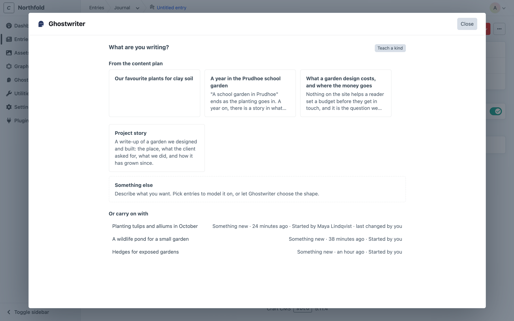
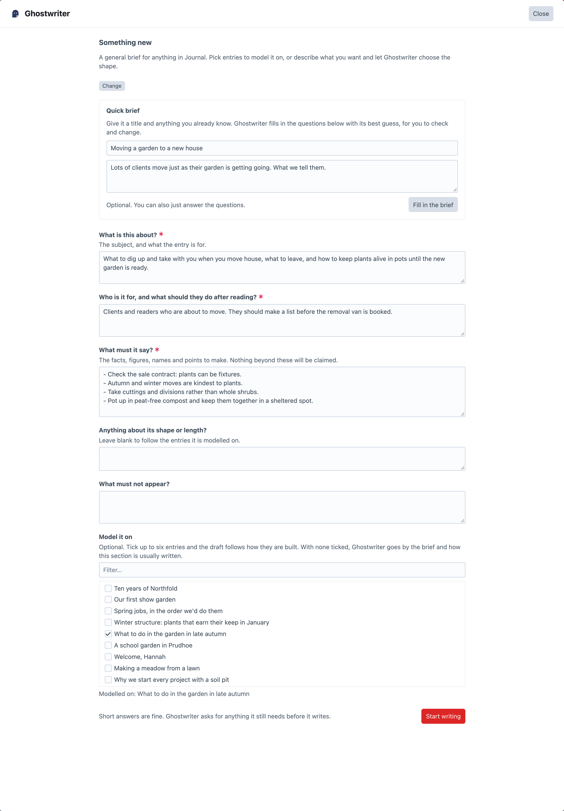
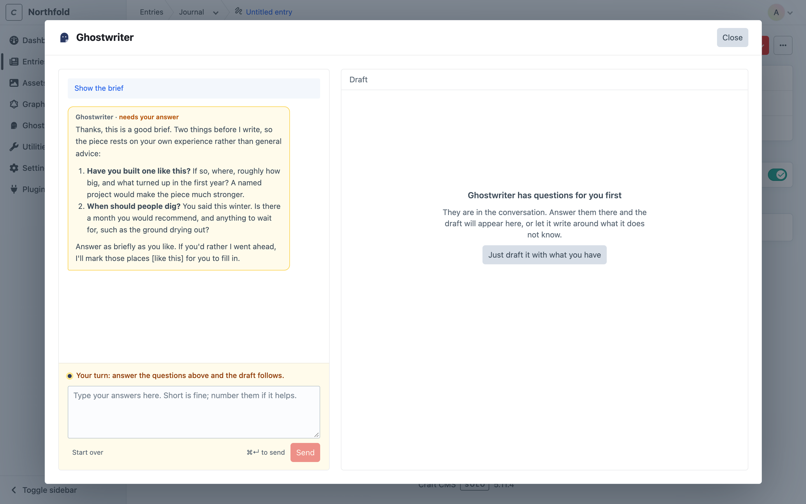
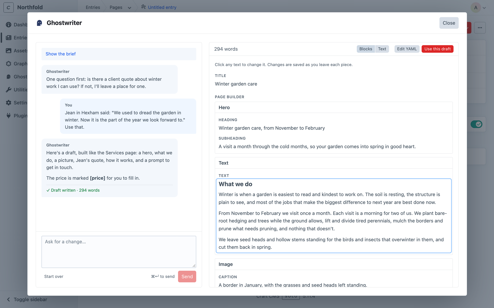
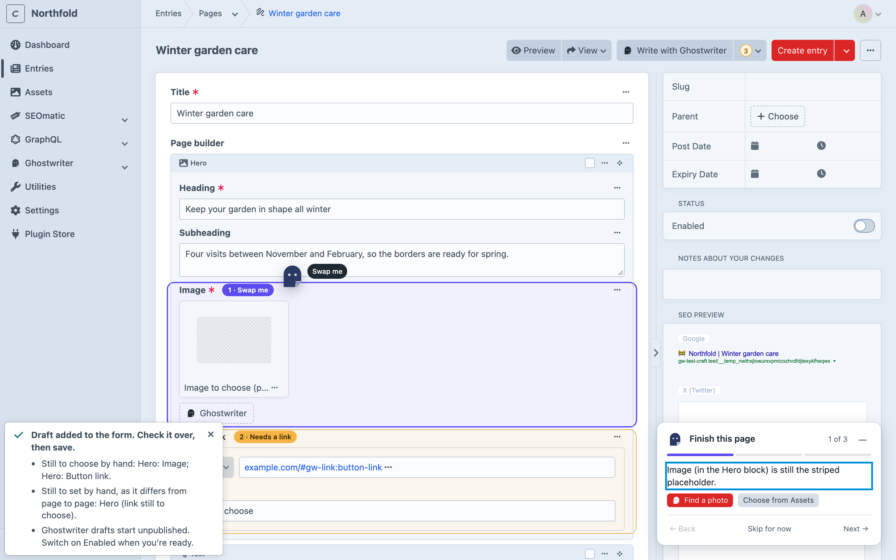

# Writing a new entry

This page covers writing a new entry with Ghostwriter, from choosing what to write to putting the draft into the entry. To change an entry that already exists, see [Editing an existing entry](editing.md).

## Starting

Open a section's new entry screen and click **Write with Ghostwriter** at the top. Or click **Write with Ghostwriter** beside **New entry** on the entry index, while a section Ghostwriter writes for is chosen: it starts a new entry with Ghostwriter open. The button shows in the sections Ghostwriter writes for, for people with the **Use Ghostwriter** permission (see [Permissions](permissions.md)).

On an existing entry, the button is **Edit with Ghostwriter**. See [Editing an existing entry](editing.md).

You can also start from Ghostwriter's own screens: **Write** beside a section on the [Overview](dashboard.md), **Write something** on the [widget](dashboard.md#the-dashboard-widget), the last step of [Get started](getting-started.md), or **Draft this** on an idea in the [content plan](content-plan.md). Each opens a new entry with Ghostwriter already open.

Ghostwriter opens in a large panel over the entry. The entry stays where it is underneath.

## What are you writing?

Choose what this entry is:

- **From the content plan**, shown first: ideas on the [content plan](content-plan.md) for this section. Its title and notes go into the quick brief, and Ghostwriter fills in the brief from them straight away.
- **A kind you taught it**, such as "Case study". It asks that kind's own questions, and models the entry on that kind's examples. See [Kinds of content](kinds.md).
- **Something like what is already here**: groups of entries built the same way (the same Matrix or Neo blocks), found from the section's own entries, such as "3 entries built the same way". Choosing one starts the general brief, modelled on those entries. Shown only for sections whose entries come in more than one shape.
- **Something else**: a general brief for anything. Tick up to six entries to **Model it on**, or leave them all unticked to let Ghostwriter choose the shape.

**Teach a kind**, beside the heading, teaches one for this section (see [Teaching a kind yourself](kinds.md#teaching-a-kind-yourself)).

Below these, **Or carry on with** lists the pieces in this section whose entry isn't saved yet, with "Started by …" and "last changed by …". With [shared conversations](permissions.md#shared-conversations) on (the default) that's everyone's pieces; otherwise only yours.

## The brief

Answer the questions. Short answers are fine; Ghostwriter asks for anything it still needs before it writes.

Without a [voice guide](guides.md), a notice says Ghostwriter will still write, but in a plain voice rather than yours.

**Quick brief.** If you'd rather not fill in every question, give a **Working title** and a few notes, then click **Fill in the brief**. Ghostwriter fills in the questions from them, and the button becomes **Try again**. Check them over: anything in `[square brackets]` needs you.

Then click **Start writing**.

An idea from the [content plan](content-plan.md) fills the brief by itself: its title and notes go into the quick brief, and Ghostwriter fills in the questions from them.

> Ghostwriter uses only facts from the brief and the conversation. It doesn't invent figures, quotes or client names. Where it needs something it doesn't have, it asks, or leaves a `[note in square brackets]` for you.

## The conversation

While Ghostwriter works, a line says what it's probably doing ("Reading the brief…", "Thinking it through…", "Writing. Long drafts take a while…"; "Revising the draft…" for a change).

If Ghostwriter needs more before it can write, it asks. Its question is highlighted, headed **Ghostwriter needs your answer**. Above the answer box it says "Your turn: answer the questions above and the draft follows." (or, once there is a draft, "Your turn: answer above to carry on."). Answer there, or click **Just draft it with what you have** to have it write now and mark the gaps in `[square brackets]`.

Ghostwriter's replies are shown with their formatting: lists, bold and links.

Once there is a draft, ask for changes in plain words:

- "Make the opening shorter."
- "Add a section on cost, after the process."
- "Less formal."

Press **⌘↵** (or **Ctrl+↵**) to send, or click **Send**. A draft usually takes a minute or two. **Show the brief** shows what you asked for at the start.

Each draft adds a line to the conversation, such as "Draft written · 294 words" or "Draft updated · 270 → 279 words (+9)".

If a turn fails (the provider was busy, say), the panel says **That didn’t work** with the reason, and **Try again** sends the same message again. See [Troubleshooting](troubleshooting.md#that-didnt-work).

## The draft

The draft sits on the right, laid out the way the entry is built: its fields, and its Matrix or Neo blocks in order.

- **Blocks / Text** switches between the full layout and just the words.
- **Change any writing where it's shown.** The draft says "Click any writing (or Tab to it) to change it. It’s saved when you leave it; Esc puts it back." Click it, or press **Tab** to reach it, and type. It's saved when you leave it. **Esc** puts it back as it was, and **Enter** finishes a one-line piece such as a heading.
- **Edit YAML** opens the whole draft as text, to add, move or remove blocks. Most people never need it.

While Ghostwriter is working, the draft can't be changed, since what it writes would replace the change.

The word count is shown at the top. A block type the section doesn't allow is flagged, and left out when the draft is used. A block with nothing to write says "Uses its usual settings."

## Use this draft

**Use this draft** puts the draft into the entry, then reloads the form so you can see it.

- **Nothing is saved or published.** It goes into the entry's own Craft draft. Check it over, then save the entry as usual, or discard it.
- **A new entry starts unpublished.** Its **Enabled** switch is turned off, so you can save it straight away, and an AI draft is never published by accident. The notification says "Ghostwriter drafts start unpublished. Switch on Enabled when you're ready." Switch it on when the entry is ready. An existing entry's status is never changed. Turn this off with **New entries start unpublished** in the [settings](configuration.md#settings) (`draftsUnpublished`).
- Using it again replaces what is in the form.
- Opening the panel again carries on with the same piece, with a line saying it's already in the entry.

A notification says "Draft added to the form. Check it over, then save." If there's anything still for you to do, it lists it, and stays until you close it. For example:

- **Still to choose by hand**: related entries, categories, dates, images.
- **Still to set by hand, as it differs from page to page**: links the [house style](fields.md#house-style) couldn't settle, which point to `https://example.com` for now.
- **A striped placeholder marks each image still to pick**, where the section's entries usually have a picture. Replace them with the [image button](images.md).

## Carrying on later

The conversation is saved as you go. Close the panel and open it again on the same entry, and it carries on with the last piece you were on, including after a page reload. Coming back later, choose it under **Or carry on with**, click it under **In progress** on the [Overview](dashboard.md), or click **Resume** on its idea in the [content plan](content-plan.md).

**Start over** goes back to **What are you writing?** to begin a new piece. The earlier piece isn't deleted; it is still offered under **Or carry on with**, and stays on the Overview until it's removed.

A piece leaves **In progress** once its entry is saved. A draft put into the entry and left unsaved is still listed, as "In the entry, not saved".

## Sharing conversations

Conversations are shared with everyone who may use Ghostwriter, so a colleague can pick a piece up where you left it. Each message shows who sent it, and **Or carry on with** says who started each piece and who last changed it. See [Shared conversations](permissions.md#shared-conversations).
