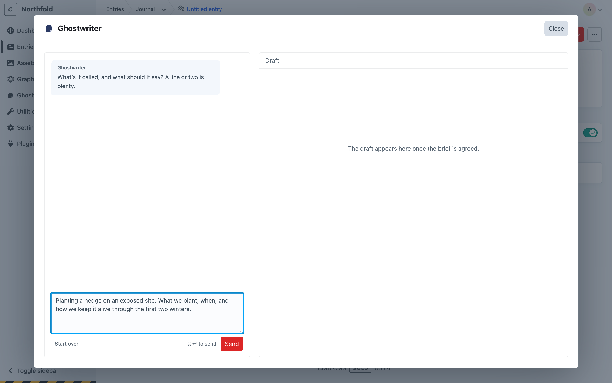

# Writing a new entry

This page covers writing a new entry with Ghostwriter, from choosing what to write to putting the draft into the entry. To change an entry that already exists, see [Editing an existing entry](editing.md).

## Starting

Open a section's new entry screen and click **Write with Ghostwriter** at the top. Or click **Write with Ghostwriter** beside **New entry** on the entry index, while a section Ghostwriter writes for is chosen: it starts a new entry with Ghostwriter open. The button shows in the sections Ghostwriter writes for, for people with the **Use Ghostwriter** permission (see [Permissions](permissions.md)).

On an existing entry, the button is **Edit with Ghostwriter**. See [Editing an existing entry](editing.md).

You can also start from Ghostwriter's own screens: **Write** beside a section on the [Overview](dashboard.md), **Write something** on the [widget](dashboard.md#the-dashboard-widget), the last step of [Get started](getting-started.md), or **Draft this** on an idea in the [content plan](content-plan.md). Each opens a new entry with Ghostwriter already open.

Ghostwriter opens in a large panel over the entry. The entry stays where it is underneath.

## What are you writing?

Choose what this entry is:


- **From the content plan**, shown first: ideas on the [content plan](content-plan.md) for this section. Ghostwriter fills in the brief from the idea's title and notes straight away, without asking first.
- **A kind you taught it**, such as "Case study". It asks that kind's own questions, and models the entry on that kind's examples. See [Kinds of content](kinds.md).
- **Something like what is already here**: groups of entries built the same way (the same Matrix or Neo blocks), found from the section's own entries, such as "3 entries built the same way". Choosing one starts the general brief, modelled on those entries. Shown only for sections whose entries come in more than one shape.
- **Something else**: a general brief for anything. Tick up to six entries under **Model it on** in the brief, or leave them all unticked to let Ghostwriter choose the shape.

**Teach a kind**, beside the heading, teaches one for this section (see [Teaching a kind yourself](kinds.md#teaching-a-kind-yourself)).

Below these, **Or carry on with** lists the pieces in this section whose entry isn't saved yet, with "Started by …" and "last changed by …". With [shared conversations](permissions.md#shared-conversations) on (the default) that's everyone's pieces; otherwise only yours.

## The brief

Once you've chosen, the conversation opens and Ghostwriter asks for the quick details in one message: "What’s it called, and what should it say? A line or two is plenty." Answer in the box below it: a working title and a line or two is enough. Press **⌘↵** (or **Ctrl+↵**) or click **Send**.



Without a [voice guide](guides.md), a notice says Ghostwriter will still write, but in a plain voice rather than yours.

Ghostwriter then fills in the whole brief for that kind of content from your answer ("Filling in the brief…", one model call), and shows it in the conversation as the **brief card**:

- **Working title**.
- Every one of the kind's questions, with its answer.
- **Model it on**, with the entries it will follow ticked (the kind's own examples, when it has them). Tick or untick up to six.

Anything only you can know, such as a figure, a quote or a client's name, is left in `[square brackets]` for you, and the card says so. Ghostwriter never makes up facts about your organisation: a figure or quote you didn't give is replaced with `[Add: the figure]` or `[Add: the quote]`.

Change any answer in the card, then:

- **Looks right, start writing** keeps the brief on the piece and starts the writing. Anything still in square brackets is fine: Ghostwriter asks about it, or leaves the gap marked in the draft. A required question can't be left empty.
- **Try again** fills in the brief again from what you said. The answers you changed are kept exactly as you wrote them; the rest are answered afresh.


**Draft this** on an idea in the [content plan](content-plan.md) skips the question: the brief card arrives already filled in from the idea, ready to check.

Once agreed, the card folds away to **Show the brief**. Open it to read or change the brief at any time and click **Save the brief**: nothing is rewritten straight away, and Ghostwriter works from the changed brief from your next message. It can't be changed while Ghostwriter is working.

The card is a labelled region, and screen readers hear "The brief is filled in. Check it, then start writing." when it arrives. Press **⌘↵** (or **Ctrl+↵**) in the card to agree to it (or to save it, once agreed).

> Ghostwriter uses only facts from the brief and the conversation. It doesn't invent figures, quotes or client names. Where it needs something it doesn't have, it asks, or leaves a `[note in square brackets]` for you.

## The conversation

After **Looks right, start writing**, the conversation carries on. While Ghostwriter works, a line says what it's probably doing ("Reading the brief…", "Thinking it through…", "Writing. Long drafts take a while…"; "Revising the draft…" for a change).

If Ghostwriter needs more before it can write, it asks. Its question is highlighted, headed **Ghostwriter needs your answer**. Above the answer box it says "Your turn: answer the questions above and the draft follows." (or, once there is a draft, "Your turn: answer above to carry on."). Answer there, or click **Just draft it with what you have** to have it write now and mark the gaps in `[square brackets]`.


Ghostwriter's replies are shown with their formatting: lists, bold and links.

Once there is a draft, ask for changes in plain words:

- "Make the opening shorter."
- "Add a section on cost, after the process."
- "Less formal."

Press **⌘↵** (or **Ctrl+↵**) to send, or click **Send**. A draft usually takes a minute or two. **Show the brief** opens the brief card again (see [The brief](#the-brief)).

Each draft adds a line to the conversation, such as "Draft written · 294 words" or "Draft updated · 270 → 279 words (+9)".

If a turn fails (the provider was busy, say), the panel says **That didn’t work** with the reason, and **Try again** sends the same message again. If filling in the brief fails, **Try again** fills it in again. See [Troubleshooting](troubleshooting.md#that-didnt-work).

## The draft

The draft sits on the right, in three tabs:

- **Preview** (the default once there's a draft) shows it as the page it would make, rendered by the section's own template. See [Preview](#preview).
- **Blocks** lays it out the way the entry is built: its fields, and its Matrix or Neo blocks in order.
- **Text** shows just the words.

The arrow keys move between the tabs.
- **Change any writing where it's shown.** The draft says "Click any writing (or Tab to it) to change it. It’s saved when you leave it; Esc puts it back." Click it, or press **Tab** to reach it, and type. It's saved when you leave it. **Esc** puts it back as it was, and **Enter** finishes a one-line piece such as a heading.
- **Edit YAML** opens the whole draft as text, to add, move or remove blocks. Most people never need it.

While Ghostwriter is working, the draft can't be changed, since what it writes would replace the change.

The word count is shown at the top. A block type the section doesn't allow is flagged, and left out when the draft is used. A block with nothing to write says "Uses its usual settings."


### Preview

**Preview** renders the draft through the section's own page template, as Craft's own preview does, so you see the page as it would look. "Rendered with the site’s own templates. Hover to see the blocks. Nothing is saved until you use the draft." The frame's bar reads **Preview · not saved**.

- **Nothing is saved.** Ghostwriter builds exactly what **Use this draft** would put in, and renders it without saving any draft, entry or nested entry. Image fields show what **Use this draft** would put there: an image you've chosen, a stock photo's preview (to editors, as in Live Preview), or the striped placeholder once Ghostwriter has made one in that volume.
- **Hover to see the blocks.** Each block of the page builder, each section of rich text and each top-level field is outlined with its name as the pointer moves over it ("Where to put one · in Body"). The outlines follow the page as it resizes and loads.
- **Desktop / Phone** switches the width: the panel's width, or 390 px. On a phone, Desktop shows the page laid out at 1280 px, scaled to fit.
- **After a change** (a new draft, a change in the conversation, or writing changed in Blocks or Text), the preview renders again once the changes stop. "Updating preview…" shows in the bar while it does, and the last version stays in view.
- **Gaps show as what they are**, not as raw text. A fact only you know (`[[ask: adult ticket price]]` in the draft) is an amber chip reading "adult ticket price", titled "Only you know this: add it before publishing". A [count to check](finish-this-page.md#counts-to-check) shows its number ("3 areas") with a dotted amber underline, titled "Counted from '…'. Check it before publishing". A link still to choose has a dashed amber underline, titled "Link to choose". Screen readers hear "Fact to add:", "Count to check:" and "(link to choose)". The chips are only shown: the draft, and the entry once you use it, keep the markers, so [Finish this page](finish-this-page.md) finds them. The layout cards' thumbnails show them too. Clicking a chip doesn't open the guide yet, because the guide works on the entry's form, which doesn't have the draft until you use it.
- **Links in the preview do nothing**, so you stay on the draft. Forms can't be sent from it.
- **Edits** of an existing entry are previewed the same way: the entry with the changes, unsaved.

When there's no page to show, the tab says why and offers **Show blocks instead**:

- the section has no URLs, or no template, for this site;
- the template couldn't render the draft ("The page template couldn’t render this draft: …"; admins also see the error and the template);
- the page took more than 8 seconds (with a page already showing, it stays: "This page is slow to render; showing the last version").

Turn the tab off with `preview` in [configuration](configuration.md).

#### For template authors

A preview is a normal page request with a token, so your templates run as they do in Craft's Live Preview. `craft.app.request.isPreview` is true for any preview, and `ghostwriterPreview` is true only for Ghostwriter's:

```twig
{# Analytics and embeds: not in any preview #}

  <script async src="https://www.googletagmanager.com/gtag/js?id=G-XXXX"></script>


{# Something only for Ghostwriter's preview #}
…
```

Even without that, third-party scripts (tag managers, analytics, chat widgets) and their requests are blocked in the preview; your site's own scripts run. If your templates load scripts from a CDN, allow it with `previewScriptHosts`. The page is shown in a frame on the control panel's own domain, so a server that sends `X-Frame-Options: DENY` for every page stops the preview, as it stops Live Preview. CKEditor nested entries render through their entry type's partial template (`_partials/entry/<type handle>.twig`); one with no partial shows as a plain box with its text.

### Layouts

The first draft comes laid out more than one way. Above the draft, up to three **layout cards** show the same words arranged differently: the writer's own layout first (**As written**), then up to two others. Each card has a small live picture of the page it makes (rendered with your templates, like the Preview), its name, a line on what it does, how many blocks it has, and **Suggested** on the one most like your existing pages. *Suggested* means "like your pages", not "best".

- **Choose a card** and the Preview, Blocks and Text show that layout, and the button reads **Use this draft (Sections apart)**. The choice is kept on the piece, so everyone working on it sees the same one. Choosing costs nothing: no model call.
- **The words are the same in every layout.** A layout only moves them between blocks, splits or joins them, and may place an extra (below). It never writes words of its own. Change writing where it's shown, as usual, and every layout follows. In a layout other than *As written*, words the layout put together from several places in the draft are shown but not edited there ("Put together for this layout…"): change them in *As written*, or ask in the conversation.
- **While the other layouts are found** (one more model call, after the draft), the draft already shows, and two cards say "Finding other layouts…".
- **After you change the draft**, the other layouts follow it. One that no longer fits says **Needs refreshing** and can't be chosen; **Refresh layouts** asks again (one model call).
- The row is hidden when there's only one layout: an entry that's being edited, a page with too little to arrange, or when no other layout came back. Nothing is shown as an error.
- On a phone the cards scroll sideways. The cards are buttons: **Tab** reaches them, **←** and **→** move between them, **Enter** or **Space** chooses.

There's no setting: this is how drafting works (a first draft is two model calls, the writer and the layout planner; later changes are one).

### Extras

With the first draft, the writer also prepares **extras** where your section has a block for them: numbers, a pull quote, questions and answers, an "at a glance" box, captions, a second call to action, a testimonial, a short intro. A layout uses them where it has room; one that no layout uses never reaches the entry.

They're at the foot of the **Text** tab: "Prepared with the draft, only from what you told me, the draft itself or your existing pages."

- Each extra says whether the chosen layout uses it (**Used in Sections apart**), and each item where it came from: *from your brief*, *from your answer · question 2*, *from the draft*, *from* one of your pages (linked), or *your words* once you've changed it.
- **Nothing is made up.** An item whose facts aren't in what you gave Ghostwriter is dropped. One waiting on a fact only you know says **Needs your answer**.
- **A count it worked out** ("3 counties" from "Northumberland, Durham and Cumbria") is counted by Ghostwriter, not the model, and says **Counted from your brief: “…”** and **Needs review**. It's a step in [Finish this page](finish-this-page.md#counts-to-check) before the page can go live.
- **A fact to add or a count to check shows as a chip**, as in the Preview. Click it to change it, and you'll see the words as they're kept, markers included (`[[ask: years trading]]`).
- **Click an item to change it.** It's saved when you leave it. Enter finishes, and Esc puts it back as it was.
- **✕** deletes an extra (or one item of it). A layout that used it is arranged again without it.

## Use this draft

**Use this draft** puts the draft into the entry, then reloads the form so you can see it.

- **The chosen layout goes in** (see [Layouts](#layouts)), with any extras it uses. With *As written* chosen, it's the draft as written.
- **Nothing is saved or published.** It goes into the entry's own Craft draft. Check it over, then save the entry as usual, or discard it.
- **A new entry starts unpublished.** Its **Enabled** switch is turned off, so you can save it straight away, and an AI draft is never published by accident. The notification says "Ghostwriter drafts start unpublished. Switch on Enabled when you're ready." Switch it on when the entry is ready. An existing entry's status is never changed. Turn this off with **New entries start unpublished** in the [settings](configuration.md#settings) (`draftsUnpublished`).
- Using it again replaces what is in the form.
- Opening the panel again carries on with the same piece, with a line saying it's already in the entry.

A notification says "Draft added to the form. Check it over, then save." If there's anything still for you to do, it lists it, and stays until you close it. For example:

- **Still to choose by hand**: related entries, categories, dates, images.
- **Still to set by hand, as it differs from page to page**: links the [house style](fields.md#house-style) couldn't settle, which point to `https://example.com` for now.
- **A striped placeholder marks each image still to pick**, where the section's entries usually have a picture. Replace them with the [image button](images.md).


## Carrying on later

The conversation is saved as you go. Close the panel and open it again on the same entry, and it carries on with the last piece you were on, including after a page reload. Coming back later, choose it under **Or carry on with**, click it under **In progress** on the [Overview](dashboard.md), or click **Resume** on its idea in the [content plan](content-plan.md).

**Start over** goes back to **What are you writing?** to begin a new piece. The earlier piece isn't deleted; it is still offered under **Or carry on with**, and stays on the Overview until it's removed.

A piece leaves **In progress** once its entry is saved. A draft put into the entry and left unsaved is still listed, as "In the entry, not saved".

## Sharing conversations

Conversations are shared with everyone who may use Ghostwriter, so a colleague can pick a piece up where you left it, brief card and all. Each message shows who sent it, and **Or carry on with** says who started each piece and who last changed it. See [Shared conversations](permissions.md#shared-conversations).
